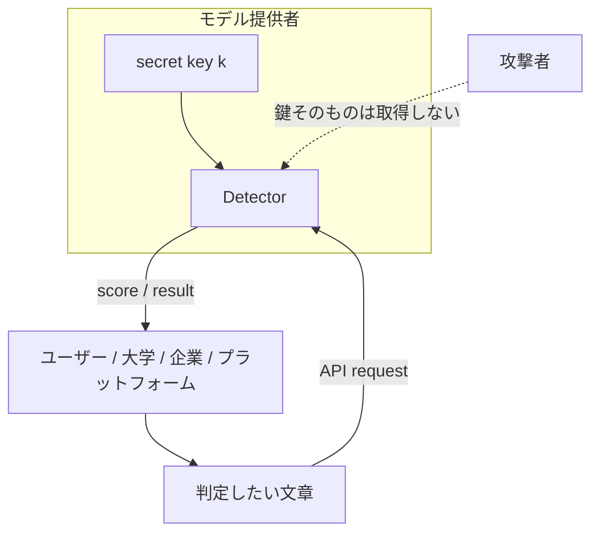
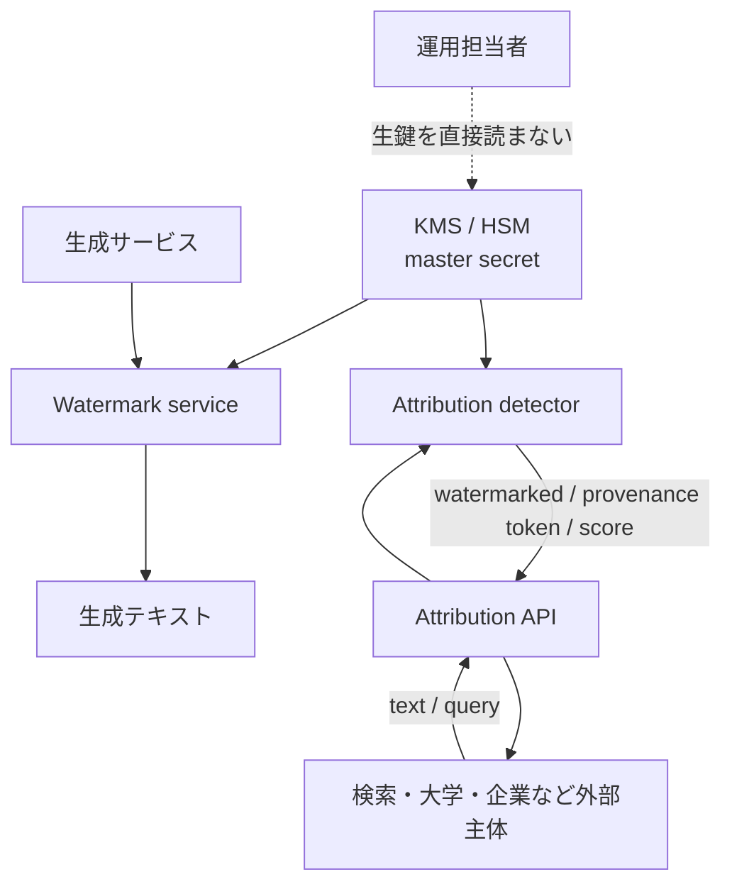
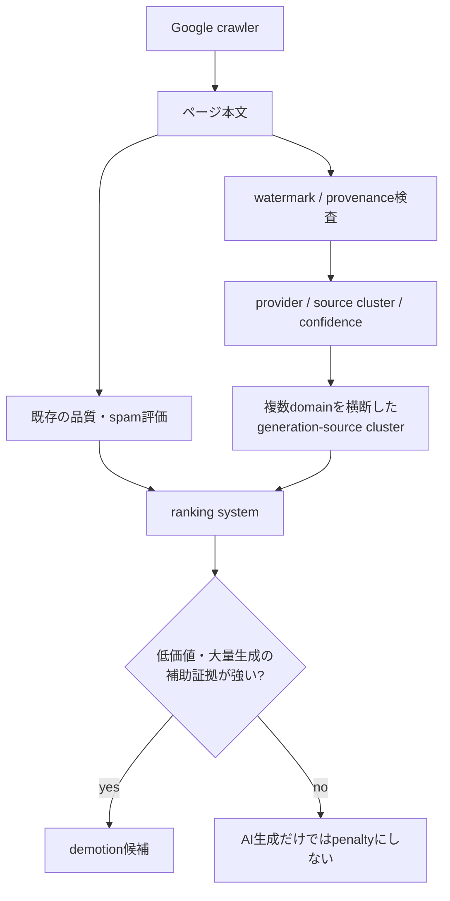
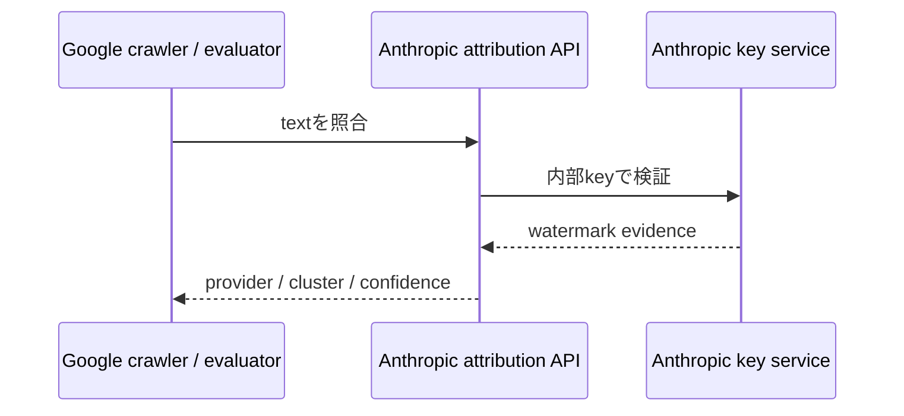

きっかけは、Claudeのテキスト透かしについて解説したZenn記事でした。

- https://zenn.dev/hellorusk/articles/3328866ca9e922

読んでいて、ひとつ引っかかりました。

**もし透かしが「秘密鍵から疑似乱数を作り、その偏りを文章へ埋め込む」方式なら、その疑似乱数を誰が知っているのでしょうか。Anthropic本社しか判定できないのでしょうか。**

最初は「検出にはLLMをもう一度動かすので高コストなのでは」と考えました。しかし原論文を読むと、難所はかなり別の場所にありました。

検出計算そのものは、LLM推論を必要としない方式がすでに存在します。むしろ厄介なのは、**同じ疑似乱数を再現するための鍵を誰に持たせるか**です。

さらに調べると、問いはもう一段先へ進みました。

もし単なる「AI生成か否か」ではなく、**生成元を識別できるフィンガープリント**を文章へ埋め込めるなら、将来は検索エンジンが、別々のサイトに散らばった大量生成コンテンツを同じ生成源へ結びつけることも技術的には考えられます。

ただし、この記事では次の3層を混ぜません。

1. **確認済みの事実**: Anthropic、Google、公開論文が実際に公表していること
2. **既存研究から実現可能な設計**: user IDやprovenanceを埋め込む研究例
3. **将来仮説**: Google Searchなどがそれをランキングsignalに使う可能性

2026年8月13日時点で、Anthropicがユーザー固有watermarkを採用している事実も、Google Searchがtext watermarkをranking signalとして使用している事実も確認できません。

## 1. まず、Claudeについて確定していることは少ない

Anthropic公式のHelp Centerは、Claudeのmarkについて、ユーザーや第三者が検出できるようにする作業を進めていると説明しています。また、具体的な検出方式は今後のtechnical documentationで公開するとしています。

- Anthropic公式: https://support.claude.com/en/articles/16266773-how-claude-marks-ai-generated-content

ここから確定できるのは次の範囲です。

| 項目 | 2026-08-13時点 |
|---|---|
| Claudeがmarkを付与する | Anthropic公式が説明 |
| ユーザー・第三者向け検出 | 提供に向けて作業中 |
| 検出アルゴリズム | 未公表 |
| 秘密鍵の有無 | 未公表 |
| 鍵を誰が保持するか | 未公表 |
| ユーザー固有watermark | 未公表 |
| 公開Detector/API | 技術仕様は未公表 |

したがって、**「ClaudeはKGW方式だ」「ClaudeはSynthIDと同じ秘密鍵PRFを使う」「Anthropicだけが鍵を持つ」「Claudeはユーザーごとの鍵を持つ」までは言えません。**

ここから先は、Claudeの実装を推測するのではなく、公開済みのウォーターマーク研究から「鍵付き方式なら誰が何を知る必要があるか」を確認します。

## 2. 疑似乱数列を保存しているわけではない

Google DeepMindのSynthID-Text論文では、生成ステップ `t` ごとのseedを、直前のcontextとwatermarking keyから作る一般形を説明しています。実験では直近 `H=4` tokenと鍵をhashするsliding-window方式を使っています。

- Nature: https://www.nature.com/articles/s41586-024-08025-4
- Google DeepMind公式reference implementation: https://github.com/google-deepmind/synthid-text

概念を最小化すると、こうなります。

```text
context_t + watermark key k
        ↓
  hash / seed generator
        ↓
     seed r_t
        ↓
疑似乱数・token score
        ↓
次tokenのsamplingへ統計的signatureを入れる
```

重要なのは、巨大な「透かし乱数表」を事前に保存して照合する必要がないことです。

同じ `context`、同じ鍵 `k`、同じseed生成規則があれば、**検出側は生成時と同じ値をその場で再計算できます。**


この構造なら、「疑似乱数を誰が把握しているのか」という問いは少し変わります。

**把握すべきなのは乱数列そのものではなく、それを再現できる鍵と規則です。**

なお、SynthID-Textを「確率へ単純に乱数を掛ける方式」と説明するのは正確ではありません。Nature論文のTournament samplingでは、LLM分布から複数のcandidate tokenをsampleし、疑似乱数関数 `g` のscoreを用いたtournamentで最終tokenを選びます。論文は、設定によってsingle-tokenまたはsequence levelでnon-distortionaryにできることを議論しています。

Google DeepMind自身の説明でも、SynthIDはtokenの生成確率をmodulateしてwatermarkを埋め込むと説明されています。

- https://deepmind.google/blog/watermarking-ai-generated-text-and-video-with-synthid/

## 3. 検出にはLLMをもう一度走らせなくてよい

ここが最初の予想と違いました。

KirchenbauerらのICML 2023論文は、提案するウォーターマークの検出について、モデルparameterもlanguage model APIも不要であり、そのため検出をcheap and fastにできると説明しています。

- ICML / PMLR: https://proceedings.mlr.press/v202/kirchenbauer23a.html
- PDF: https://proceedings.mlr.press/v202/kirchenbauer23a/kirchenbauer23a.pdf

SynthID-Textも同じ方向です。Nature論文では、watermark detectionはunderlying LLMを使わず計算効率よく実行できるとしています。

つまり概念的なDetectorは、次の処理に近いです。

```python
score = 0
for t, token in enumerate(tokens):
    seed = keyed_seed(tokens[:t], key)
    score += watermark_score(token, seed)

return score > threshold
```

実際の方式はもっと複雑ですが、少なくとも「Claude級のLLMを再推論して文章らしさを判定する」という計算ではありません。

### 数字として確認できるコスト

SynthID-Text論文には、生成側の実測値があります。Gemma 7B-ITを4台のv5e TPUで動かした例では、通常生成が **15.527 ms/token**、30-layer Tournament samplingを加えた場合が **15.615 ms/token** で、増加は **0.57%** でした。

- https://www.nature.com/articles/s41586-024-08025-4

ただし、この0.57%は**検出コストではなく、透かしを埋め込む生成側のlatency overhead**です。Claudeの検出レイテンシを示す数字でもありません。

検出側について一次情報から安全に言えるのは、既存方式では「LLM推論を必要とせず、計算効率の高いscoringとして実装できる」までです。

Nature論文では、実サービス上の品質確認として約 **2,000万件のGemini response** を用いたlive experimentも報告されています。これは「透かしが研究室だけの玩具ではなく、大規模生成系へ入れられる」ことの実証として重要です。

## 4. 本当の問題は「鍵を誰に渡すか」だった

では、検出が安いなら誰でも判定器を持てばよいのでしょうか。

ここでセキュリティ上のトレードオフが出ます。

ICML 2023の論文には、**private watermarking**が明示されています。private modeではrandom keyを秘密にし、secure APIの背後に置きます。攻撃者はどのtokenがwatermark上有利か分かりにくくなります。

しかし同じ論文は、その代償も書いています。

private modeではwatermark検査にも同じsecure APIが必要になります。さらにthreat modelでは、private modeは **model ownerだけがwatermarkを評価し、外部にはtext detection APIを提供する**構成です。APIは攻撃者による多数queryを防ぐためrate limitする想定です。

つまり、鍵を秘密にしたまま第三者検出を実現するなら、構造はこうなります。



この場合、外部ユーザーは「判定できる」のに「鍵は知らない」という状態を作れます。

ここが、最初の「Anthropic本社だけが判定できるのか？」という問いへの重要な答えです。

**秘密鍵方式でも、判定結果を外部へ提供することはできます。鍵を配る必要はありません。**

ただし、その場合はDetector運営者を信頼する必要があります。

## 5. public modeとprivate modeは、別の失敗をする

Kirchenbauerらのthreat modelでは、public modeでは第三者がwatermarkを評価できます。一方、private modeではmodel ownerが評価し、APIを公開する構成です。

比較すると、単純な優劣ではありません。

| 設計 | 長所 | 弱点 |
|---|---|---|
| Public | 第三者が自前で検証しやすい | 攻撃者にも判定規則が見える |
| Private key + API | 鍵を隠したまま外部判定を提供できる | 判定サービスへの依存、rate limit、監査問題 |

private modeでは、APIを何度も叩きながら文章を少しずつ変更し、scoreが下がる方向を探索される可能性があります。そのため原論文自身がAPI accessの監視とrate limitingを論点にしています。

つまり鍵を隠すと、問題は暗号だけでは終わりません。

**Detectorそのものがセキュリティ境界になります。**

## 6. 「公開検出」と「秘密鍵」は矛盾しない

ここまでを整理すると、次の二つは同時に成立します。

1. 秘密鍵はprovider内部から出さない
2. 第三者はproviderのDetector APIを使って判定できる

したがって、Anthropic公式が述べている「users and other third partiesがClaudeのmarkをdetectできるようにする」という将来像は、秘密鍵方式とも論理的には両立します。

ただし、**Anthropicが実際にこのprivate API方式を採るとはまだ確認できません。**

Claudeについて公開されているのは「第三者検出を可能にする方向」と「技術詳細はforthcoming documentationで説明する」という範囲です。鍵、PRF、threshold、API、rate limit、public/privateのどれを採るかは未公表です。

## 7. もし「ユーザー固有」にしたら何が変わるか

ここで、単一のprovider watermarkから一段進めます。

仮に全ユーザーへ同じ `k` を使うのではなく、ユーザーごとに異なる識別情報を生成へ入れられるとします。

最も単純な思考実験はこうです。

```text
Provider master secret K
          │
          ├─ user A → K_A
          ├─ user B → K_B
          ├─ user C → K_C
          └─ user D → K_D
```

このとき `user_id` のような予測可能な数値を秘密鍵そのものにする必要はありません。設計上は、provider内部のmaster secretからuser-specific keyや識別子を導出し、生鍵を外部へ出さない構成が考えられます。

ただし、**これはClaudeやGeminiが現在そうしているという説明ではありません。** あくまで一般的な鍵管理の設計例です。

さらに、ユーザーごとの鍵を全部試して帰属する以外にも、生成文中へmulti-bit provenanceを直接埋め込む研究があります。

### 研究ではuser IDを本文へ埋め込めるところまで来ている

USENIX Security 2025の `Provably Robust Multi-bit Watermarking for AI-generated Text` は、user IDをbit stringとして生成textへ埋め込み、生成元ユーザーへtraceする **content source tracing** を明示的に扱っています。

- https://www.usenix.org/conference/usenixsecurity25/presentation/qu-watermarking

同論文の報告では、**20-bit messageを200-token textへ埋め込む設定で97.6%のmatch rate**を示しています。これは特定条件の実験値であり、あらゆる文章・編集・モデルで97.6%を保証する数字ではありません。

ICML 2025のStealthInkも、multi-bit watermarkへ `userID`、`TimeStamp`、`modelID` のようなprovenance dataを埋め込める方式を提案しています。

- https://proceedings.mlr.press/v267/jiang25j.html

つまり研究上は、

```text
AI-generated?          → zero-bit detection
どの生成源だった?      → multi-bit provenance / source tracing
```

という二段階を区別できます。

ここから、透かしは単なる「AI文章検出」ではなく、**生成源のクラスタリングや帰属**に使える可能性が出てきます。

## 8. 権限を誰が持つべきか

user-specific watermarkを仮定した場合、「誰が鍵を見るか」と「誰が判定結果を見るか」は分けた方が安全です。

概念設計としては次のようになります。



この構成では、一般ユーザー、検索エンジン、大学、広告プラットフォームへmaster keyを配る必要はありません。

さらに、外部へ実ユーザーIDを返す必要もありません。

たとえば、同じ生成主体を束ねるだけなら、provider側が外部から逆引きしにくいstable pseudonymous identifierを返す設計も考えられます。

```text
text A ─┐
text B ─┼─ Detector API → source_cluster = 7f29...
text C ─┘
```

外部側は「A/B/Cは同じ生成源らしい」と扱えても、そのsourceが誰なのかというidentity mappingはprovider内部に残せます。

これは**実在サービスの仕様ではなく、privacyとsource tracingを両立させるための設計仮説**です。

## 9. 半年後に一番インパクトがあるとしたら、検索ランキングかもしれない

ここからは明示的に**将来仮説**です。

2026年8月13日時点で、Google SearchがSynthID Textや他社のtext watermarkをranking signalとして利用しているというGoogle公式情報は確認できません。

一方、Google Searchの現行ポリシーはかなり重要な前提を置いています。

Googleは「AI生成だから悪い」とはしていません。生成AIは調査やoriginal contentの構造化に有用だと説明する一方、**ユーザーへの価値を加えず大量ページを生成する行為**はscaled content abuseに該当し得るとしています。

- Google Search Central: https://developers.google.com/search/docs/fundamentals/using-gen-ai-content?hl=ja
- Google spam policies: https://developers.google.com/search/docs/essentials/spam-policies?hl=ja

spam policyでは、scaled content abuseは「どう作られたか」に依存しません。generative AI、人力、自動化の組合せにかかわらず、検索順位操作を目的に大量の低価値・非独自コンテンツを作ることが問題です。

この前提と、watermark source tracingを組み合わせると、半年後、つまり**2027年2月ごろまでの技術的な可能性**として次の構造を想像できます。



ここで重要なのは、**watermark陽性 = 順位を下げる**ではありません。

それではGoogle自身の現行方針とも整合しません。

むしろ価値があるのは、watermarkを

> 「このページはAI生成らしい」

という1bit判定に使うのではなく、

> 「一見無関係な数百domainの記事が、同じ生成源clusterから大量に出ている」

という新しい観測量へ変えることです。

### 従来は見えにくかったネットワークが見える

たとえば、見た目には別運営に見えるサイト群があるとします。

```text
site-a.example/article-1 ─┐
site-b.example/howto-92 ──┤
site-c.example/news-312 ──┼─ source_cluster = 7f29...
site-d.example/guide-8  ──┤
site-e.example/faq-51   ──┘
```

さらに、一定期間に大量公開され、内容の独自性も低く、既存のspam signalも悪いとします。

その場合、source tracingは単独判定ではなく、

```text
大量生成
+ 独自価値が低い
+ 複数domainへ分散
+ 同一generation-source fingerprint
```

を結ぶ補助signalとして使えます。

これはGoogle Searchの現行scaled content abuse policyと方向性が噛み合います。現在のpolicy自身も、**複数siteを作ってscaled natureを隠す行為**を例として挙げています。

- https://developers.google.com/search/docs/essentials/spam-policies?hl=ja

### Googleには自社側の技術基盤がすでにある

Google DeepMindのSynthIDは、textを含むAI-generated contentへwatermarkを埋め込み識別する技術です。現在の公式ページでは、Gemini app / webで生成されたtextへのSynthID watermarkingも説明されています。

- https://deepmind.google/models/synthid/

公式reference implementationでは、watermark configurationの主要要素として `keys: Sequence[int]` が公開されています。またBayesian detectorは**unique watermarking keyごとにtrainingが必要**と明記されています。

- https://github.com/google-deepmind/synthid-text

これは「Google Searchがこのkey群を使っている」という証拠ではありません。

ただし、**watermark configurationごとの検出を実装できる技術基盤そのものは公開済み**です。

## 10. Googleが他社の秘密鍵を受け取る必要はない

ここで最初の疑問へ戻ります。

仮にGoogle SearchがClaudeなど他社LLMのwatermark provenanceをrankingの補助signalとして使いたくなったとしても、GoogleへAnthropicのsecret key群を渡す必要はありません。

より自然なのは、provider側のDetector APIを使う設計です。



この形なら、

- Anthropicはsecret keyを外へ出さない
- Googleは生成源clusterだけ取得できる
- 実ユーザーidentityをGoogleへ渡さない設計も可能
- Detector accessをrate limit / auditできる

という分離ができます。

もちろん、**GoogleとAnthropicがこのような連携を計画しているという一次情報はありません。**

これは現在公開されているprivate watermark設計とsource tracing研究を組み合わせたarchitecture hypothesisです。

## 11. この仮説の弱点

検索品質への利用を想像すると魅力的ですが、watermarkは万能ではありません。

Google DeepMind自身もSynthIDについてsilver bulletではないと説明しており、text watermarkは長く、多様な出力ほど機能しやすいとしています。

- https://deepmind.google/blog/watermarking-ai-generated-text-and-video-with-synthid/

Nature論文でも、watermark detectionはtext lengthや生成分布のentropyに依存します。短文、低entropy出力、大幅な編集や変換では証拠が弱くなる可能性があります。

したがって検索ランキングへ入るとしても、現実的なのは

```text
ranking = f(
  helpfulness,
  originality,
  spam signals,
  site signals,
  watermark evidence,
  provenance cluster,
  other behavioral signals
)
```

のように、**多数あるsignalの一つ**として使う形です。

またsource tracingはprivacy上の論点も大きいです。生成文から個人アカウントへ直接帰属できる設計なら、誤判定、権限分離、保存期間、法執行アクセス、異議申立て、監査可能性が必要になります。

検索品質を上げられることと、個人追跡を無制限に許してよいことは別問題です。

## 12. 「Claudeが書いた証明」と考えると危ない

もう一つ重要なのは、Detectorの意味です。

Anthropic公式は、supported markが見つかった場合、それはcontentがClaudeによって**processedされた可能性**を示すものとして説明しています。

- https://support.claude.com/en/articles/16266773-how-claude-marks-ai-generated-content

したがって、検出結果をそのまま

> この文章は最初から最後までClaudeが著者として書いた

という証明に読み替えるべきではありません。

watermark detectorが答えるのは、著者人格ではなく、**特定の生成・処理経路に由来する統計的signatureが残っているか**です。

この区別は、大学の不正判定や採用選考、メディア検証、検索ランキングで特に重要になります。

## 13. 再現するときは「Claude detector」を作らない

現時点ではClaudeの方式が未公表なので、Claude判定器を自作したと主張するのは不適切です。

再現可能なのは、公開論文に基づく**toy keyed watermark detector**までです。

たとえば次の順序なら、鍵がある側だけが同じscoreを再現できる構造を確認できます。

```text
1. 固定keyを1つ作る
2. context + keyをhashしてseedを作る
3. seedから各tokenへ疑似乱数scoreを割り当てる
4. 生成時は高score tokenを少し優遇する
5. 検出時は同じkeyでscoreを再計算する
6. keyを変えると統計的偏りが消えることを確認する
```

ここで確認できるのは「鍵付きウォーターマークの原理」であって、Claudeの内部実装ではありません。

さらにsource tracingを再現したい場合も、実ユーザー情報を使わず、たとえば `user-0001` のようなsynthetic IDをbit列として埋め込み、復号精度・false attribution・編集耐性を測るべきです。

## 14. 今後確認したいこと

### Anthropicが技術文書を公開したら確認する5項目

1. Claude text watermarkのseed生成方式
2. detectorが秘密情報を必要とするか
3. 第三者Detectorがlocal実行かAnthropic APIか
4. score / threshold / false-positive評価の公開範囲
5. user-specific attributionやprovenance IDを持つか

### Google Searchについて確認する4項目

1. SynthID TextをSearch ranking / spam detectionへ利用すると公式発表するか
2. 他社watermark detectorとのinteroperabilityを公開するか
3. provider-level detectionだけか、source-level clusteringまで行うか
4. provenance signalを使う場合のprivacy / appeal / transparency policyを公開するか

ここが分かれば、「透かしが検索品質へ効く」という仮説を事実ベースで更新できます。

## 15. 持ち帰り

最初は、Claudeの透かし検出はLLMを再実行する重い処理だと思っていました。

公開論文を読むと、むしろ逆でした。

**鍵付きテキストウォーターマークでは検出計算は軽量化できる。難しいのは、同じ疑似乱数を再現できる鍵を誰に持たせ、第三者検証と攻撃耐性をどう両立するかである。**

さらにmulti-bit watermarkまで考えると、透かしの意味は「AIかどうか」から「どの生成源か」へ変わります。

そこで半年後に大きなインパクトがあるとすれば、単純なAI文章判定ではなく、**検索エンジンが別々のサイトに散らばった低価値な大量生成コンテンツを同じ生成源clusterへ結びつけ、既存のspam signalと組み合わせられるようになること**かもしれません。

ただしこれは2026年8月13日時点では予測です。Google Searchがwatermarkをranking signalに使っていることも、Anthropicがユーザー固有watermarkを実装していることも確認できません。

今後見るべきなのは「AI detectorの精度」だけではありません。

**誰が鍵を保持し、誰がsource attributionを照会でき、その結果がどの意思決定システムへ渡るのか。**

そこが、この技術の本当のインパクトを決めます。

## 一次情報

- Anthropic, How Claude marks AI-generated content  
  https://support.claude.com/en/articles/16266773-how-claude-marks-ai-generated-content
- Kirchenbauer et al., A Watermark for Large Language Models, ICML 2023  
  https://proceedings.mlr.press/v202/kirchenbauer23a.html
- Kirchenbauer et al., paper PDF  
  https://proceedings.mlr.press/v202/kirchenbauer23a/kirchenbauer23a.pdf
- Dathathri et al., Scalable watermarking for identifying large language model outputs, Nature 2024  
  https://www.nature.com/articles/s41586-024-08025-4
- Google DeepMind, SynthID  
  https://deepmind.google/models/synthid/
- Google DeepMind, Watermarking AI-generated text and video with SynthID  
  https://deepmind.google/blog/watermarking-ai-generated-text-and-video-with-synthid/
- Google DeepMind, SynthID-Text reference implementation  
  https://github.com/google-deepmind/synthid-text
- Google Search Central, 生成AIコンテンツのガイダンス  
  https://developers.google.com/search/docs/fundamentals/using-gen-ai-content?hl=ja
- Google Search Central, スパムに関するポリシー  
  https://developers.google.com/search/docs/essentials/spam-policies?hl=ja
- Qu et al., Provably Robust Multi-bit Watermarking for AI-generated Text, USENIX Security 2025  
  https://www.usenix.org/conference/usenixsecurity25/presentation/qu-watermarking
- Jiang et al., StealthInk: A Multi-bit and Stealthy Watermark for Large Language Models, ICML 2025  
  https://proceedings.mlr.press/v267/jiang25j.html
