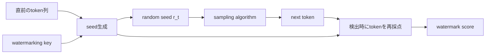
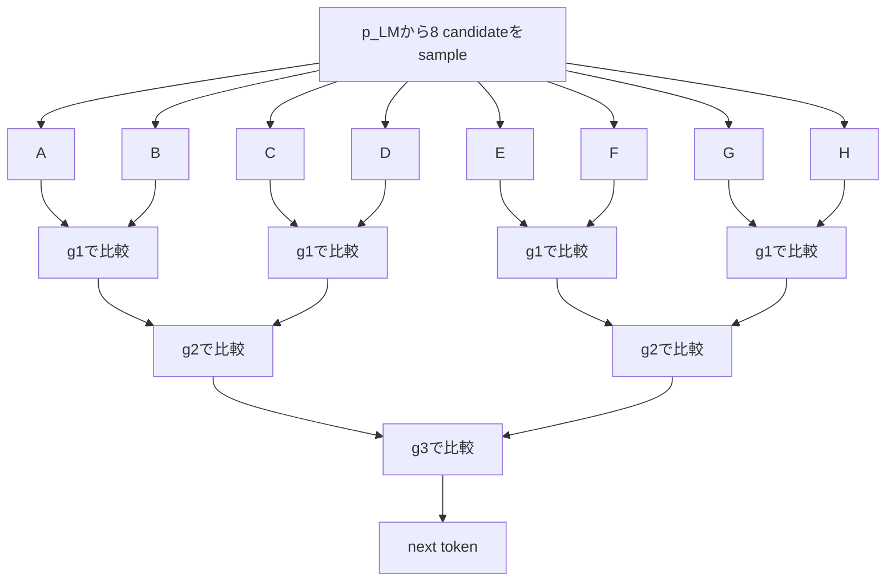
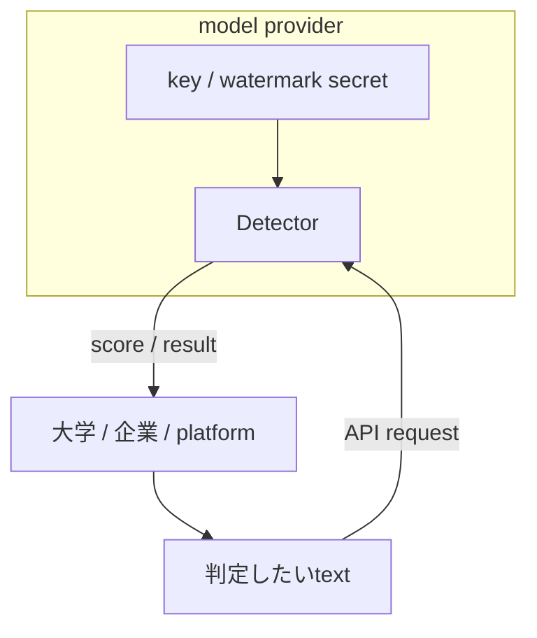
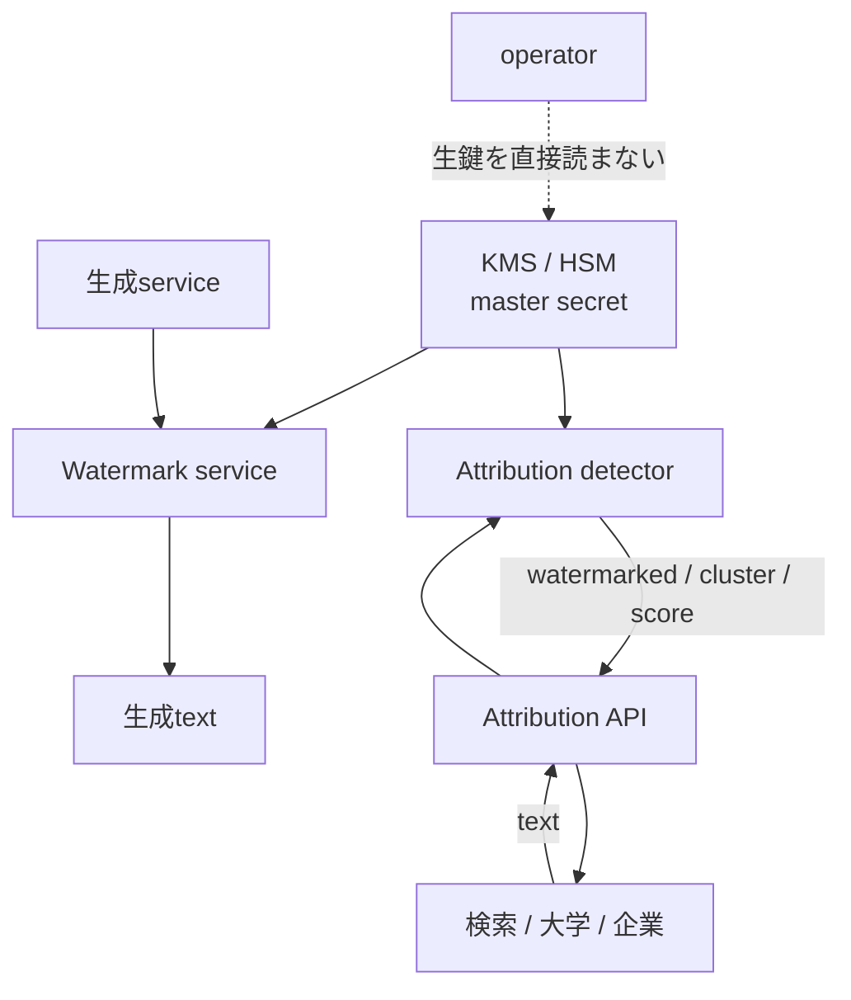
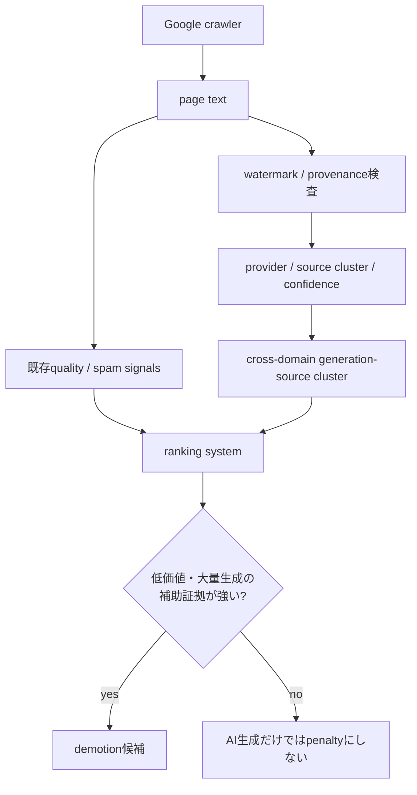
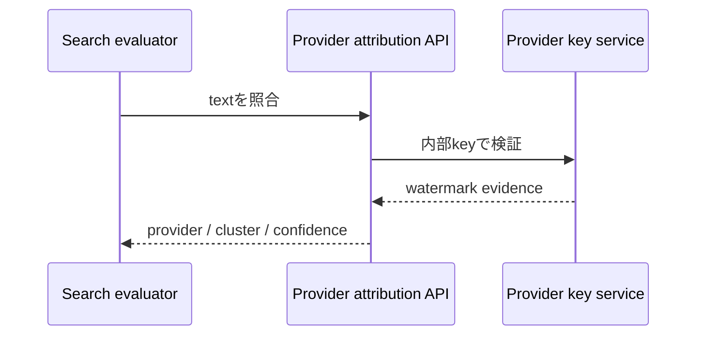

きっかけは、Claudeのテキスト透かしについて解説したZenn記事でした。

- https://zenn.dev/hellorusk/articles/3328866ca9e922

読んでいて、ひとつ引っかかりました。

**もし透かしが「鍵から疑似乱数を作り、その偏りを文章へ埋め込む」方式なら、その疑似乱数を誰が再現できるのでしょうか。Anthropic本社しか判定できないのでしょうか。**

最初は「検出にはLLMをもう一度動かすので高コストなのでは」と考えました。しかし公開論文を読むと、難所は別の場所にありました。

検出計算そのものは、LLM推論を必要としない方式がすでに存在します。むしろ厄介なのは、**同じ疑似乱数を再現するための鍵を誰に持たせるか**です。

さらに調べると、問いはもう一段先へ進みました。

もし単なる「AI生成か否か」ではなく、**生成元を識別できるフィンガープリント**を文章へ埋め込めるなら、将来は検索エンジンが、別々のサイトに散らばった大量生成コンテンツを同じ生成源へ結びつけることも技術的には考えられます。

ただし、この記事では次の3層を混ぜません。

1. **確認済みの事実**: Anthropic、Google、EU、公開論文が実際に公表していること
2. **既存研究から実現可能な設計**: user IDやprovenanceを埋め込む研究例
3. **将来仮説**: Google Searchなどがそれをranking signalに使う可能性

2026年8月13日時点で、Anthropicがユーザー固有watermarkを採用している事実も、Google Searchがtext watermarkをranking signalとして使用している事実も確認できません。

## 1. Claudeについて確定していることは少ない

Anthropic公式のHelp Centerは、Claudeのmarkについて、ユーザーや第三者が検出できるようにする作業を進めていると説明しています。また、具体的な検出方式は今後のtechnical documentationで公開するとしています。

- Anthropic公式: https://support.claude.com/en/articles/16266773-how-claude-marks-ai-generated-content

ここから確定できるのは次の範囲です。

| 項目 | 2026-08-13時点 |
|---|---|
| Claudeがmarkを付与する | Anthropic公式が説明 |
| ユーザー・第三者向け検出 | 提供に向けて作業中 |
| 検出アルゴリズム | 未公表 |
| 秘密鍵の有無 | 未公表 |
| 鍵を誰が保持するか | 未公表 |
| ユーザー固有watermark | 未公表 |
| 公開Detector/API | 技術仕様は未公表 |

したがって、**「ClaudeはKGW方式だ」「ClaudeはSynthIDと同じ鍵付きPRFを使う」「Anthropicだけが鍵を持つ」「Claudeはユーザーごとの鍵を持つ」までは言えません。**

ここから先は、Claudeの実装を推測するのではなく、公開済みのウォーターマーク研究から「鍵付き方式なら誰が何を知る必要があるか」を確認します。

## 2. SynthID-Textは「seed生成」「sampling」「score」の3部品に分けて考える

Google DeepMindのSynthID-Text論文は、generative watermarkingを大きく3つの部品に分けています。

```text
1. random seed generator
2. sampling algorithm
3. scoring function
```

生成ステップ `t` では、直前のcontextとwatermarking keyからseed `r_t` を作り、そのseedをsampling algorithmへ渡します。検出時は、観測されたtokenと同じseed生成規則を使い、生成時に入った相関をscoring functionで測ります。

論文の実験では、seed生成に直近 `H=4` tokenとwatermarking keyをhashするsliding-window方式を使っています。

- Nature: https://www.nature.com/articles/s41586-024-08025-4
- Google DeepMind公式reference implementation: https://github.com/google-deepmind/synthid-text



重要なのは、巨大な「乱数表」を保存して照合する必要がないことです。

同じcontext、同じkey、同じseed生成規則があれば、**検出側は生成時と対応する疑似乱数を再計算できます。**

ただし、ここで `watermarking key` と書いてあるからといって、公開reference implementationの `keys` をそのまま「暗号学的秘密鍵」と呼ぶのは正確ではありません。

Google DeepMindのreference implementationは `keys: Sequence[int]` を主要configurationとして公開していますが、同じREADMEで `accumulate_hash()` は**cryptographic securityを保証しない**と明記しています。reference implementationもproduction use向けではないとされています。

- https://github.com/google-deepmind/synthid-text

したがって、研究実装上のinteger keysと、実サービスでの秘密鍵管理は分けて考える必要があります。

## 3. Tournament samplingはGumbel-Maxの「勝ち抜き版」ではない

ここは特に誤解しやすいところです。

「Tournament sampling」と聞くと、Gumbel-Max trickの亜種のように見えます。しかしSynthID-Text論文では、**Tournament samplingとGumbel samplingは別のsampling algorithmとして直接比較されています。**

しかも比較条件を揃えるため、Tournament、Gumbel、Soft Red Listの全てに同じ `H=4` sliding-window random seed generatorとrepeated context maskingを使っています。

つまり、違うのはseed generatorではなく、**そのseed由来の乱数をsamplingのどこへ作用させるか**です。

### Gumbel sampling

Gumbel-Maxでは、候補tokenごとにGumbel noiseを使い、確率分布から1 tokenを選びます。

概念的には、

```text
vocabulary上の候補
      │
log p(token) + Gumbel noise
      │
    argmax
      │
   next token
```

という構造です。

乱数が、候補tokenの確率と直接組み合わされて最終選択を決めます。

### Tournament sampling

一方、SynthID-TextのTournament samplingは、まずLLM分布 `p_LM` から複数のcandidate tokenを普通にsampleします。

Nature論文のFig. 2の例では `m=3`、各matchのcompetitor数 `N=2` なので、最初に8 candidateを引きます。その後、candidate同士をpairにし、seedから作られた疑似乱数的な `g_1` scoreで勝者を選びます。次のroundは別の `g_2`、最後は `g_3` を使います。



各 `g_l(token, r_t)` は、token、layer番号、seedから疑似乱数的な値を与える関数です。論文では主にBernoulli(0.5)のg-valueを使っています。

この違いを一表にするとこうです。

| | Gumbel sampling | Tournament sampling |
|---|---|---|
| 最初の対象 | vocabulary上の分布 | `p_LM`から引いたcandidate群 |
| 乱数の作用点 | token選択のargmax | candidate同士の勝敗 |
| 選択構造 | 1回のargmax | 多段knockout |
| seed generator | 同じ方式を使える | 同じ方式を使える |
| Nature論文での位置づけ | non-distortionary baseline | SynthID-Textの新規sampling algorithm |

Nature論文では、non-distortionary設定においてTournament samplingはGumbel samplingより同じtext lengthで高いdetectabilityを示し、とくに低entropy条件で差が大きいと報告しています。

- https://www.nature.com/articles/s41586-024-08025-4

また、論文はTournament samplingを「確率へ乱数を単純に掛ける方式」とは説明していません。

**先にLLM分布からcandidateを引き、その後で鍵から再現可能なg-valueを使って勝ち残りを決める。**

これが重要な違いです。

## 4. 検出にはLLMをもう一度走らせなくてよい

ここが最初の予想と違いました。

KirchenbauerらのICML 2023論文は、提案するwatermark検出について、model parameterもlanguage model APIも不要であり、cheap and fastにできると説明しています。

- https://proceedings.mlr.press/v202/kirchenbauer23a.html

SynthID-Textも同じ方向です。Nature論文では、watermark detectionはunderlying LLMを使わず計算効率よく実行できるとしています。

つまり、概念的には

```text
text
  ↓
tokenize
  ↓
context + keyからseedを再計算
  ↓
g-value / watermark scoreを再計算
  ↓
統計score
  ↓
threshold判定
```

です。

### 数字として確認できるコスト

SynthID-Text論文には、生成側の実測値があります。Gemma 7B-ITを4台のv5e TPUで動かした例では、通常生成が **15.527 ms/token**、30-layer Tournament samplingを加えた場合が **15.615 ms/token** で、増加は **0.57%** でした。

ただし、この0.57%は**検出コストではなく、透かしを埋め込む生成側のlatency overhead**です。Claudeの検出レイテンシを示す数字でもありません。

Nature論文では、約 **2,000万件のGemini response** を使ったlive experimentも報告され、human feedback上でtext qualityを維持できることを確認しています。

- https://www.nature.com/articles/s41586-024-08025-4

## 5. 2026年8月にこの話が急に現実味を持つ理由：EU AI Act Article 50

この技術を「研究者が面白いから作っている」だけで見ると背景を落とします。

EU AI Act Article 50(2)は、synthetic audio / image / video / textを生成するAI systemのproviderに対し、出力を**machine-readable formatでmarkし、artificially generated or manipulatedであるとdetectableにすること**を要求しています。

技術的解決策についても、technically feasibleな範囲で `effective`, `interoperable`, `robust`, `reliable` であることを要求しています。

- EUR-Lex, Regulation (EU) 2024/1689, Article 50: https://eur-lex.europa.eu/eli/reg/2024/1689/oj?locale=en

このArticle 50の関連透明性義務は **2026年8月2日** から適用されています。

EU AI Officeがfacilitateした `Code of Practice on Transparency of AI-Generated Content` は2026年6月10日に最終版が公開されました。Codeへの参加自体はvoluntaryですが、Article 50(2)/(4)等の義務を履行するための実務的なcompliance routeとして位置づけられています。2026年7月8日にはCommissionが、CodeがArticle 50(2)/(4)/(5)を十分にカバーすると評価しました。

- https://digital-strategy.ec.europa.eu/en/policies/code-practice-ai-generated-content
- https://digital-strategy.ec.europa.eu/en/library/how-sign-code-practice-transparency-ai-generated-content
- https://digital-strategy.ec.europa.eu/en/library/commission-opinion-assessment-code-practice-transparency-ai-generated-content

したがって法的には、

```text
AI Act Article 50 = mandatory obligation
Code of Practice  = voluntary compliance mechanism
```

です。

「行動規範が義務を作った」のではなく、**AI Actが義務を作り、Codeが履行方法を具体化している**と整理するのが正確です。

なお、Anthropicが「ClaudeのmarkingはEU AI Act対応のために実装した」と明言した一次情報は、現時点では確認できません。

ただしEU市場では、providerがmachine-readableかつdetectableなmarkingへ対応する制度的圧力がすでに存在します。

## 6. 本当の問題は「鍵を誰に渡すか」

検出が比較的軽いなら、誰でも判定器を持てばよいのでしょうか。

ここでセキュリティ上のtrade-offが出ます。

KirchenbauerらのICML 2023論文はprivate watermarkingを扱い、random keyを秘密にしたままsecure APIの背後へ置く構成を議論しています。



この構成なら、外部ユーザーは「判定できる」のに「鍵は知らない」という状態を作れます。

つまり、**公開検出と秘密鍵は矛盾しません。鍵を配らずDetector APIだけ公開できます。**

ただし、その場合Detector自体がsecurity boundaryになります。原論文も、攻撃者が検出APIを多数queryしてwatermark除去を探索するリスクを考え、rate limiting等を議論しています。

## 7. user-specific watermarkにすると「AI判定」から「source tracing」へ変わる

仮に全ユーザーへ同じmarkを使うのではなく、ユーザーごとに異なる識別情報を生成へ入れられるとします。

`user_id` のような予測可能な数値を秘密鍵そのものにする必要はありません。概念設計としては、provider内部のmaster secretからuser-specific keyや識別子を導出できます。

```text
Provider master secret K
          │
          ├─ user A → K_A
          ├─ user B → K_B
          ├─ user C → K_C
          └─ user D → K_D
```

ただし、これはClaudeやGeminiが現在そうしているという説明ではありません。

一方、研究ではuser ID等をmulti-bit watermarkとして本文へ埋め込むところまで進んでいます。

USENIX Security 2025の `Provably Robust Multi-bit Watermarking for AI-generated Text` は、user IDをbit stringとして生成textへ埋め込み、生成元ユーザーへtraceする **content source tracing** を扱っています。20-bit messageを200-token textへ埋め込む実験設定で97.6%のmatch rateを報告しています。

- https://www.usenix.org/conference/usenixsecurity25/presentation/qu-watermarking

ICML 2025のStealthInkも、`userID`, `TimeStamp`, `modelID` のようなprovenance dataをmulti-bit watermarkへ埋め込む方式を提案しています。

- https://proceedings.mlr.press/v267/jiang25j.html

研究上は、

```text
AI-generated?      → zero-bit detection
どの生成源だった?  → multi-bit provenance / source tracing
```

を区別できます。

## 8. その権限を誰が持つべきか

user-specific watermarkを仮定した場合、「誰が鍵を見るか」と「誰が判定結果を見るか」は分離した方が安全です。



一般ユーザーや検索エンジンへmaster keyを配る必要はありません。

外部へ実ユーザーidentityを返す必要もありません。同じ生成主体を束ねるだけなら、stable pseudonymous identifierだけ返す設計も考えられます。

```text
text A ─┐
text B ─┼─ Detector API → source_cluster = 7f29...
text C ─┘
```

これは実在serviceの仕様ではなく、privacyとsource tracingを分離するarchitecture hypothesisです。

## 9. 半年後に一番インパクトがあるとしたら検索ランキングかもしれない

ここからは**将来仮説**です。

2026年8月13日時点で、Google SearchがSynthID Textや他社watermarkをranking signalとして利用しているというGoogle公式情報は確認できません。

一方、Google Searchの現行policyは「AI生成だから悪い」とはしていません。問題にしているのは、ユーザーへの価値を加えず、search ranking manipulationを目的として大量の低価値contentを生成することです。

- https://developers.google.com/search/docs/fundamentals/using-gen-ai-content?hl=ja
- https://developers.google.com/search/docs/essentials/spam-policies?hl=ja

そこでwatermark provenanceを検索へ使うなら、価値があるのは

> 「このpageはAI生成らしい」

という1bit判定ではなく、

> 「一見無関係な多数domainの記事が、同じgeneration sourceから大量に出ている」

という新しい観測量です。



Google DeepMind自身にはSynthID Textの技術基盤があります。ただし、**Google Searchがそのkey群やdetectorをrankingへ利用している証拠はありません。**

また他社LLMについても、GoogleがAnthropicのsecret key群を受け取る必要はありません。



EU AI Actの透明性義務によってprovider側にmachine-readable provenance infrastructureが整備され、その副産物が将来spam detectionへ使えるようになる、という順序の方が、単に「検索エンジンがwatermarkを欲しがった」という説明より自然です。

## 10. この仮説の弱点

watermarkは万能ではありません。

Google DeepMind自身もSynthIDをsilver bulletとはしていません。Nature論文でもdetectabilityはtext lengthや生成分布のentropyに依存します。短文、低entropy出力、大幅な編集や変換では証拠が弱くなる可能性があります。

したがって検索ランキングへ入るとしても、現実的なのは

```text
ranking = f(
  helpfulness,
  originality,
  spam signals,
  site signals,
  watermark evidence,
  provenance cluster,
  other signals
)
```

のように、多数あるsignalの一つとして使う形です。

source tracingはprivacy上の論点も大きいです。生成文から個人アカウントへ直接帰属できるなら、誤判定、権限分離、保存期間、法執行アクセス、異議申立て、監査可能性が必要になります。

## 11. 持ち帰り

最初は、Claudeの透かし検出はLLMを再実行する重い処理だと思っていました。

公開論文を読むと、むしろ逆でした。

**鍵付きtext watermarkでは検出計算は軽量化できる。難しいのは、同じ疑似乱数を再現できるkeyを誰に持たせ、第三者検証と攻撃耐性をどう両立するかである。**

そしてTournament samplingについても、単純な「Gumbel-Maxの勝ち抜き版」ではありません。

**Gumbelは乱数をtoken選択のargmaxへ作用させる。TournamentはLLM分布からcandidateを先に引き、鍵から再現可能なg-valueでcandidate同士を段階的に競わせる。**

さらにmulti-bit watermarkまで考えると、透かしの意味は「AIかどうか」から「どの生成源か」へ変わります。

EU AI Act Article 50によってmachine-readableかつdetectableなmarkingが制度的に要求され始めた今、今後見るべきなのはdetector精度だけではありません。

**誰が鍵を保持し、誰がsource attributionを照会でき、その結果がどの意思決定systemへ渡るのか。**

そこが、この技術の本当のインパクトを決めます。

## 一次情報

- Anthropic, How Claude marks AI-generated content  
  https://support.claude.com/en/articles/16266773-how-claude-marks-ai-generated-content
- Dathathri et al., Scalable watermarking for identifying large language model outputs, Nature 2024  
  https://www.nature.com/articles/s41586-024-08025-4
- Google DeepMind, SynthID-Text reference implementation  
  https://github.com/google-deepmind/synthid-text
- Kirchenbauer et al., A Watermark for Large Language Models, ICML 2023  
  https://proceedings.mlr.press/v202/kirchenbauer23a.html
- Regulation (EU) 2024/1689, Article 50  
  https://eur-lex.europa.eu/eli/reg/2024/1689/oj?locale=en
- European Commission, Code of Practice on Transparency of AI-generated Content  
  https://digital-strategy.ec.europa.eu/en/policies/code-practice-ai-generated-content
- European Commission, How to sign the Code of Practice  
  https://digital-strategy.ec.europa.eu/en/library/how-sign-code-practice-transparency-ai-generated-content
- European Commission, assessment of the Code of Practice  
  https://digital-strategy.ec.europa.eu/en/library/commission-opinion-assessment-code-practice-transparency-ai-generated-content
- Google Search Central, 生成AIコンテンツのガイダンス  
  https://developers.google.com/search/docs/fundamentals/using-gen-ai-content?hl=ja
- Google Search Central, スパムに関するポリシー  
  https://developers.google.com/search/docs/essentials/spam-policies?hl=ja
- Qu et al., Provably Robust Multi-bit Watermarking for AI-generated Text, USENIX Security 2025  
  https://www.usenix.org/conference/usenixsecurity25/presentation/qu-watermarking
- Jiang et al., StealthInk: A Multi-bit and Stealthy Watermark for Large Language Models, ICML 2025  
  https://proceedings.mlr.press/v267/jiang25j.html
