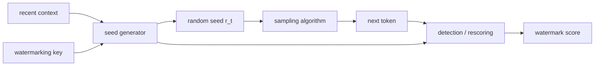
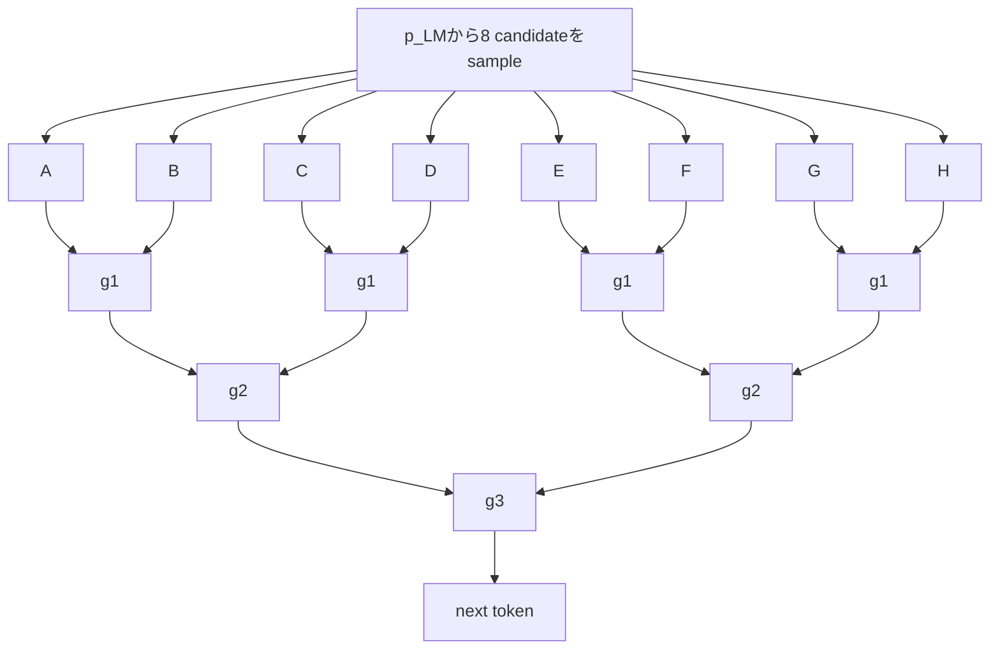
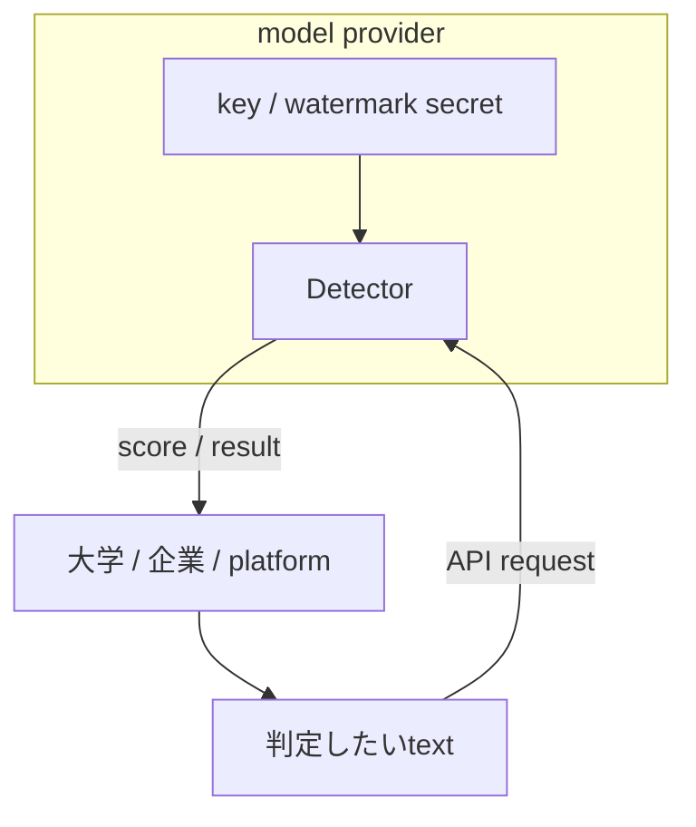
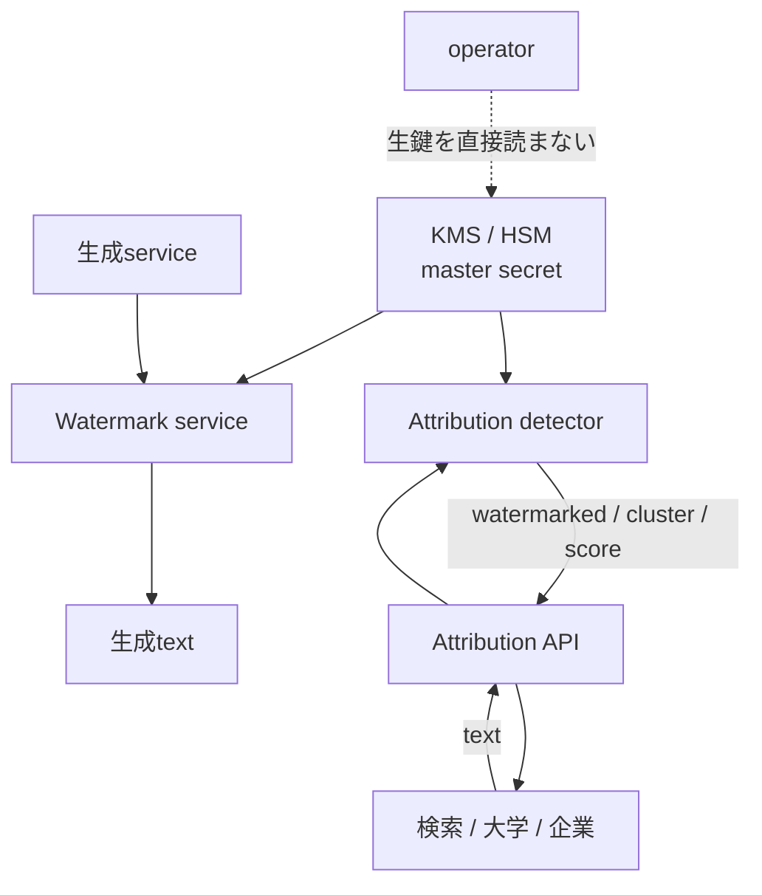
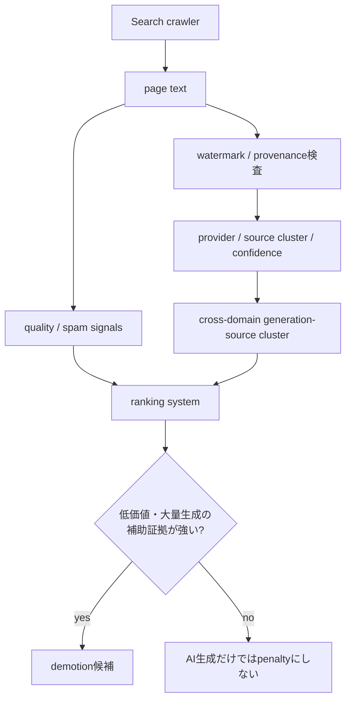
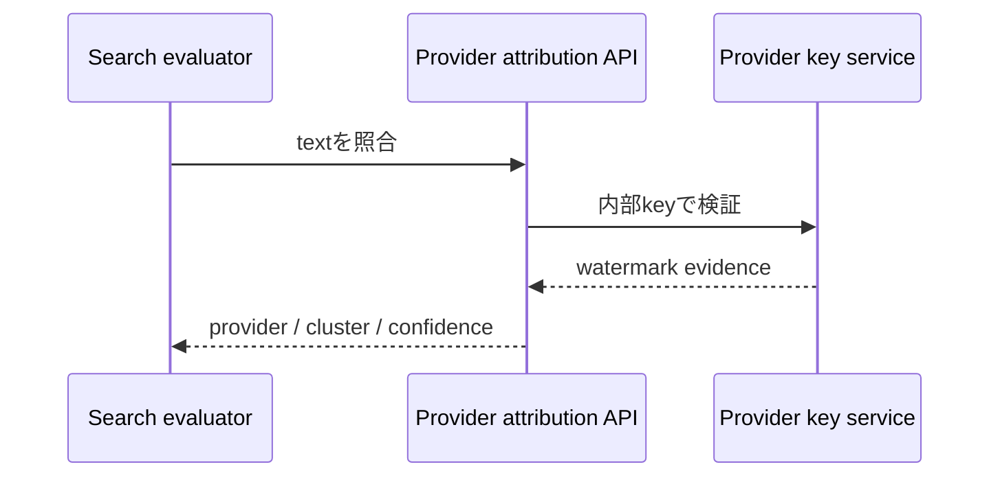

Claudeのテキスト透かしについて調べていて、いちばん気になったのは「透かしがあるか」そのものではありませんでした。

**その透かしを、誰が判定できるのか。**

もし透かしが「鍵から疑似乱数を作り、その偏りを文章へ埋め込む」方式なら、検出側は生成時と同じ疑似乱数を再現する必要があります。では、その鍵は誰が持つのでしょうか。Anthropicだけなのか。第三者にも渡せるのか。検索エンジンのような外部サービスが検証することは可能なのか。

最初は「検出にはLLMをもう一度走らせるので高コストなのでは」と考えました。しかし公開論文を読むと、難所は別の場所にありました。

**検出計算そのものは、LLM推論なしで実行できる方式がすでにあります。難しいのは、同じ疑似乱数を再現するための鍵と、その判定権限を誰に持たせるかです。**

さらにmulti-bit watermarkまで含めて考えると、透かしは「AI生成かどうか」の1bit判定から、**どの生成源から出た文章かを追跡するprovenance**へ発展します。

この記事では、次の3層を明確に分けます。

1. **確認済みの事実**: Google DeepMind、EU、公開論文が実際に公表していること
2. **既存研究から実現可能と分かっている設計**: user IDやprovenanceを埋め込むmulti-bit watermark
3. **将来仮説**: 検索エンジンなどがprovenanceをspam/ranking signalへ利用する可能性

2026年8月13日時点で、Anthropicがユーザー固有watermarkを採用している事実も、Google Searchがtext watermarkをranking signalとして利用している事実も確認できません。

## 先に結論

この記事の結論だけ先にまとめると、こうです。

```text
生成時
context + watermark key
        ↓
再現可能なseed / score
        ↓
samplingに微小な統計的偏りを入れる
        ↓
watermarked text

検出時
text + 同じseed生成規則
        ↓
watermark scoreを再計算
        ↓
統計判定
```

このタイプのwatermarkなら、検出のたびに元のLLMを再実行する必要はありません。

そして秘密鍵を第三者へ直接配る必要もありません。

```text
第三者
  ↓ text
Detector API
  ↓
provider内部のkey service
  ↓
score / 判定結果だけ返す
```

つまり、**「第三者が検出できる」と「秘密鍵を第三者へ公開する」は別問題**です。

## 1. Claudeについては、公開されていない部分を断定しない

Claudeについて重要なのは、公開仕様から確認できない実装を、SynthID-Textなど別方式から逆算して断定しないことです。

AnthropicのHelp Centerには、ClaudeのAI生成コンテンツのmarkingに関する案内があります。

- Anthropic Help Center: https://support.claude.com/en/articles/16266773-how-claude-marks-ai-generated-content

しかし、少なくとも公開情報だけから次を断定することはできません。

| 項目 | 2026-08-13時点 |
|---|---|
| Claudeの具体的な検出アルゴリズム | 公開仕様からは確定不可 |
| 暗号学的秘密鍵の有無 | 公開仕様からは確定不可 |
| 鍵を誰が保持するか | 公開仕様からは確定不可 |
| ユーザー固有watermark | 公開仕様からは確定不可 |
| Google SynthID-Textと同一方式か | 確認できない |

したがって、この記事では「ClaudeはKGW方式だ」「ClaudeはSynthIDと同じ鍵付きPRFを使う」「Anthropicだけが秘密鍵を持つ」といった実装推測はしません。

ここから先は、**公開済みのwatermark研究ではどう設計されているか**を見ます。

## 2. SynthID-Textは3部品に分けると理解しやすい

Google DeepMindのSynthID-Text論文は、generative watermarkingを大きく3部品として説明しています。

```text
1. random seed generator
2. sampling algorithm
3. scoring function
```

生成ステップ `t` では、直前のcontextとwatermarking keyからrandom seed `r_t` を作り、そのseedをsampling algorithmへ渡します。

検出時には、観測されたtoken列から同じseed生成規則を適用し、生成時に埋め込まれた相関をscoring functionで測ります。

Nature論文では、watermark seedは最近のcontextとwatermarking keyに基づいて生成されます。

- Nature: https://www.nature.com/articles/s41586-024-08025-4
- Google DeepMind reference implementation: https://github.com/google-deepmind/synthid-text



ここで重要なのは、巨大な「乱数表」を保存して照合する必要がないことです。

同じcontext、同じkey、同じseed生成規則があれば、**検出側は生成時に対応した疑似乱数系列を再計算できます。**

ただし、reference implementationに `keys` があるからといって、それをそのまま本番サービスの「暗号学的秘密鍵」と呼ぶのは危険です。Google DeepMind自身もreference implementationをproduction security仕様として提示しているわけではありません。

研究実装上のkeyと、本番KMS/HSMで管理される秘密情報は分けて考える必要があります。

## 3. Tournament samplingはGumbel-Maxの「勝ち抜き版」ではない

ここは特に誤解しやすいところです。

SynthID-Text論文では、**Tournament samplingとGumbel samplingは別のsampling algorithmとして直接比較されています。**

違うのはseed generatorそのものではなく、seed由来の乱数を**どこに作用させるか**です。

### Gumbel sampling

Gumbel-Maxは概念的には次のように、候補tokenの確率へGumbel noiseを組み合わせて選択します。

```text
vocabulary上の候補
      │
log p(token) + Gumbel noise
      │
    argmax
      │
   next token
```

### Tournament sampling

SynthID-TextのTournament samplingでは、まずLLM分布 `p_LM` から複数candidateをsampleし、そのcandidate同士をwatermarking functionのscoreで競わせます。

Nature論文Fig. 2の例では `m=3` なので、最初に `2^3 = 8` candidateをsampleします。



つまり、Tournament samplingを「確率へ乱数を単純に掛ける方式」と説明するのは正確ではありません。

**先にLLM分布からcandidateを引き、その後でseedから再現可能なg-valueを使ってcandidateを段階的に選抜する。**

Nature論文では、non-distortionary設定でTournament samplingはGumbel samplingより高いdetectabilityを示しています。

- https://www.nature.com/articles/s41586-024-08025-4

## 4. 検出には元のLLMをもう一度走らせなくてよい

ここが最初の予想と最も違った点です。

KirchenbauerらのICML 2023論文は、提案watermarkの検出にmodel parameterやlanguage model APIを必要としないことを説明しています。

- https://proceedings.mlr.press/v202/kirchenbauer23a.html

SynthID-Text論文も、watermark detectionはunderlying LLMなしでcomputationally efficientに実行できるとしています。

概念的には次です。

```text
text
  ↓
tokenize
  ↓
context + keyからseedを再計算
  ↓
g-value / watermark scoreを再計算
  ↓
統計score
  ↓
threshold判定
```

ここでの重要点は、**生成コストと検出コストを混同しないこと**です。

SynthID-Text論文には生成側のlatency overheadの実測があります。Gemma 7B-ITを4台のv5e TPUで動かした実験で、通常生成が15.527 ms/token、30-layer Tournament samplingが15.615 ms/tokenで、増加は0.57%でした。

これは**透かしを埋め込む生成側のoverhead**であり、Claudeの検出レイテンシを示す数字ではありません。

またNature論文では、約2,000万件のGemini responseを用いたlive experimentが報告されています。

- https://www.nature.com/articles/s41586-024-08025-4

## 5. 2026年8月に急に現実味を持つ理由：EU AI Act Article 50

この技術を研究上の面白さだけで見ると、2026年の制度的背景を落とします。

Regulation (EU) 2024/1689 のArticle 50(2)は、synthetic audio / image / video / text contentを生成するAI system providerに対し、出力をmachine-readable formatでmarkし、artificially generated or manipulatedであることをdetectableにすることを求めています。

- EUR-Lex: https://eur-lex.europa.eu/eli/reg/2024/1689/oj?locale=en

European Commissionの公式情報では、Article 50の関連透明性義務は**2026年8月2日から適用**されています。

- https://digital-strategy.ec.europa.eu/en/policies/code-practice-ai-generated-content

また、`Code of Practice on Transparency of AI-Generated Content` の最終版は**2026年6月10日**に公開されました。

- https://digital-strategy.ec.europa.eu/en/news/commission-publishes-code-practice-marking-and-labelling-ai-generated-content

2026年7月8日、European Commissionは、このCodeがArticle 50(2), (4), (5)の義務を十分にカバーし、effective implementationをfacilitateすると結論づけています。Commission Opinionの公開日は7月9日です。

- https://digital-strategy.ec.europa.eu/en/library/commission-opinion-assessment-code-practice-transparency-ai-generated-content

整理すると、

```text
AI Act Article 50 = 法的義務
Code of Practice  = voluntaryなcompliance mechanism
```

です。

「Codeが義務を作った」のではなく、**AI Actが義務を作り、Codeが履行の実務ルートを具体化している**という順序です。

なお、Anthropicが「ClaudeのmarkingはEU AI Act対応のために実装した」と明言した一次情報は、この記事では確認できていません。

## 6. 本当の問題は「鍵を誰に渡すか」

検出計算が比較的軽いなら、誰でも判定器を持てばよいのでしょうか。

ここでsecurity trade-offが出ます。

Kirchenbauerらはprivate watermarkingを扱い、random keyを秘密にしたままsecure APIの背後に置く構成を議論しています。



この構成なら、外部ユーザーは「判定できる」のに「鍵は知らない」という状態を作れます。

**公開Detector APIと秘密鍵管理は両立します。**

ただしDetector API自体がsecurity boundaryになります。攻撃者がDetectorを大量queryできれば、watermark除去を探索するoracleになり得るため、rate limitingやabuse detectionなどが必要になります。

## 7. user-specific watermarkにすると「AI判定」から「source tracing」へ変わる

仮に全ユーザーへ同じmarkを使うのではなく、ユーザーごとに異なる識別情報を生成へ埋め込めるとします。

`user_id` のような予測可能な値を秘密鍵そのものにする必要はありません。概念設計ならprovider内部のmaster secretからuser-specific keyを導出できます。

```text
Provider master secret K
          │
          ├─ user A → K_A
          ├─ user B → K_B
          ├─ user C → K_C
          └─ user D → K_D
```

これはClaudeやGeminiが現在採用しているという意味ではありません。

一方、研究ではmulti-bit watermarkによってprovenance dataを本文へ埋め込むところまで進んでいます。

USENIX Security 2025の`Provably Robust Multi-bit Watermarking for AI-generated Text`は、user IDをbit stringとして生成textへ埋め込み、生成元ユーザーへtraceするcontent source tracingを扱っています。

- https://www.usenix.org/conference/usenixsecurity25/presentation/qu-watermarking

ICML 2025のStealthInkも、`userID`, `TimeStamp`, `modelID`のようなprovenance dataをmulti-bit watermarkへ埋め込む方式を提案しています。

- https://proceedings.mlr.press/v267/jiang25j.html

研究上は、

```text
AI-generated?      → zero-bit detection
どの生成源だった?  → multi-bit provenance / source tracing
```

を区別できます。

## 8. 誰がその権限を持つべきか

user-specific watermarkを仮定した場合、「誰が鍵を見るか」と「誰が判定結果を見るか」は分離できます。



一般ユーザーや検索エンジンへmaster keyを配る必要はありません。

外部へ実ユーザーidentityを返す必要もありません。同一生成主体を束ねるだけなら、stable pseudonymous identifierだけ返す設計もできます。

```text
text A ─┐
text B ─┼─ Detector API → source_cluster = 7f29...
text C ─┘
```

これは実在サービスの仕様ではなく、privacyとsource tracingを分離するarchitecture hypothesisです。

## 9. 将来いちばんインパクトがあるのは検索かもしれない

ここからは**将来仮説**です。

2026年8月13日時点で、Google SearchがSynthID-Textや他社text watermarkをranking signalとして利用しているというGoogle公式情報は確認できません。

一方、Google Searchの公開policyは、AI生成であること自体を一律penaltyにするのではなく、ユーザー価値を加えずranking manipulationを目的として大量生成される低価値コンテンツを問題にしています。

- https://developers.google.com/search/docs/fundamentals/using-gen-ai-content?hl=ja
- https://developers.google.com/search/docs/essentials/spam-policies?hl=ja

もしprovenance watermarkを検索へ使うなら、価値があるのは

> 「このpageはAI生成らしい」

という1bit判定だけではありません。

> 「別々のdomainに見える大量ページが、同じgeneration sourceから出ている」

というcross-domainな観測量です。



Google DeepMindにはSynthID-Textの技術基盤があります。しかし、**Google Searchがそのdetectorやkeyをrankingへ使っている証拠はありません。**

他社LLMについても、検索エンジンがproviderのsecret keyを直接受け取る必要はありません。



EU AI Actの透明性義務によってprovider側にmachine-readable provenance infrastructureが整備され、その副産物が将来spam detectionへ利用可能になる、という経路は技術的には考えられます。

ただし、これは現時点では仮説です。

## 10. この仮説の弱点

watermarkは万能ではありません。

SynthID-Text論文でもdetectabilityはtext lengthや生成分布のentropyに依存します。短文、低entropy出力、大幅な編集やparaphraseでは証拠が弱くなり得ます。

したがって、仮に検索rankingへ入るとしても、現実的なのはwatermarkだけで順位を決める形ではありません。

```text
ranking = f(
  helpfulness,
  originality,
  spam signals,
  site signals,
  watermark evidence,
  provenance cluster,
  other signals
)
```

のような補助signalです。

source tracingにはprivacy上の論点もあります。生成文から個人アカウントへ直接帰属できるなら、誤判定、権限分離、保存期間、法執行アクセス、異議申立て、監査可能性が必要になります。

## 11. 持ち帰り

最初は、Claudeの透かし検出はLLMを再実行する重い処理だと思っていました。

公開論文を読むと、むしろ逆でした。

**鍵付きtext watermarkでは、検出計算は元のLLMなしでも実行できる。難しいのは、同じ疑似乱数を再現できるkeyを誰に持たせ、第三者検証と攻撃耐性をどう両立するかである。**

Tournament samplingについても、「Gumbel-Maxの勝ち抜き版」ではありません。

**Gumbelは乱数をtoken選択へ作用させる。TournamentはLLM分布からcandidateを先に引き、再現可能なg-valueでcandidate同士を段階的に競わせる。**

multi-bit watermarkまで進むと、透かしの意味は「AIかどうか」から「どの生成源か」へ変わります。

そして2026年8月2日からEU AI Act Article 50の関連透明性義務が適用され始めたことで、machine-readable markingは研究だけの話ではなくなりました。

今後見るべきなのはdetector精度だけではありません。

**誰が鍵を保持し、誰がsource attributionを照会でき、その結果がどの意思決定systemへ渡るのか。**

そこが、この技術の本当のインパクトを決めると思います。

## 一次情報

- Anthropic, How Claude marks AI-generated content  
  https://support.claude.com/en/articles/16266773-how-claude-marks-ai-generated-content
- Dathathri et al., Scalable watermarking for identifying large language model outputs, Nature 2024  
  https://www.nature.com/articles/s41586-024-08025-4
- Google DeepMind, SynthID-Text reference implementation  
  https://github.com/google-deepmind/synthid-text
- Kirchenbauer et al., A Watermark for Large Language Models, ICML 2023  
  https://proceedings.mlr.press/v202/kirchenbauer23a.html
- Regulation (EU) 2024/1689, Article 50  
  https://eur-lex.europa.eu/eli/reg/2024/1689/oj?locale=en
- European Commission, Code of Practice on Transparency of AI-generated Content  
  https://digital-strategy.ec.europa.eu/en/policies/code-practice-ai-generated-content
- European Commission, Commission opinion on the assessment of the Code of Practice  
  https://digital-strategy.ec.europa.eu/en/library/commission-opinion-assessment-code-practice-transparency-ai-generated-content
- Google Search Central, 生成AIコンテンツのガイダンス  
  https://developers.google.com/search/docs/fundamentals/using-gen-ai-content?hl=ja
- Google Search Central, スパムに関するポリシー  
  https://developers.google.com/search/docs/essentials/spam-policies?hl=ja
- Qu et al., Provably Robust Multi-bit Watermarking for AI-generated Text, USENIX Security 2025  
  https://www.usenix.org/conference/usenixsecurity25/presentation/qu-watermarking
- Jiang et al., StealthInk: A Multi-bit and Stealthy Watermark for Large Language Models, ICML 2025  
  https://proceedings.mlr.press/v267/jiang25j.html
