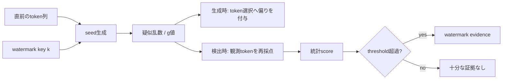
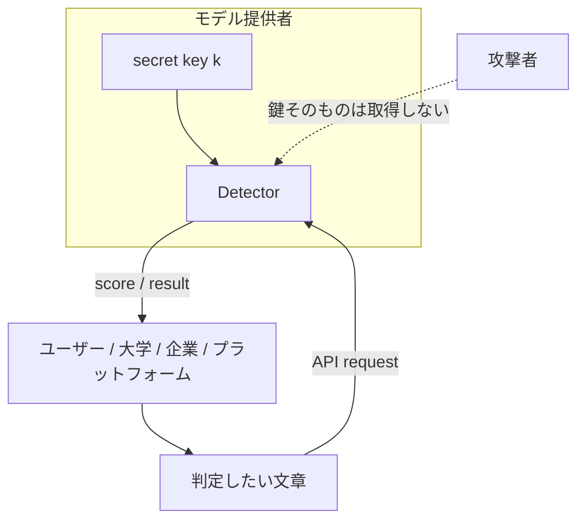

きっかけは、Claudeのテキスト透かしについて解説したZenn記事でした。

- https://zenn.dev/hellorusk/articles/3328866ca9e922

読んでいて、ひとつ引っかかりました。

**もし透かしが「秘密鍵から疑似乱数を作り、その偏りを文章へ埋め込む」方式なら、その疑似乱数を誰が知っているのでしょうか。Anthropic本社しか判定できないのでしょうか。**

最初は「検出にはLLMをもう一度動かすので高コストなのでは」と考えました。しかし原論文を読むと、難所はかなり別の場所にありました。

検出計算そのものは、LLM推論を必要としない方式がすでに存在します。むしろ厄介なのは、**同じ疑似乱数を再現するための鍵を誰に持たせるか**です。

なお、この記事ではClaude固有の未公開実装と、既存研究で公開されている鍵付きウォーターマークを明確に分けます。2026年8月13日時点でAnthropicはClaudeの検出方式・鍵管理・API仕様を技術文書として公開していません。

## 1. まず、Claudeについて確定していることは少ない

Anthropic公式のHelp Centerは、Claudeのmarkについて、ユーザーや第三者が検出できるようにする作業を進めていると説明しています。また、具体的な検出方式は今後のtechnical documentationで公開するとしています。

- Anthropic公式: https://support.claude.com/en/articles/16266773-how-claude-marks-ai-generated-content

ここから確定できるのは次の範囲です。

| 項目 | 2026-08-13時点 |
|---|---|
| Claudeがmarkを付与する | Anthropic公式が説明 |
| ユーザー・第三者向け検出 | 提供に向けて作業中 |
| 検出アルゴリズム | 未公表 |
| 秘密鍵の有無 | 未公表 |
| 鍵を誰が保持するか | 未公表 |
| 公開Detector/API | 技術仕様は未公表 |

したがって、**「ClaudeはKGW方式だ」「ClaudeはSynthIDと同じ秘密鍵PRFを使う」「Anthropicだけが鍵を持つ」までは言えません。**

ここから先は、Claudeの実装を推測するのではなく、公開済みのウォーターマーク研究から「鍵付き方式なら誰が何を知る必要があるか」を確認します。

## 2. 疑似乱数列を保存しているわけではない

Google DeepMindのSynthID-Text論文では、生成ステップ `t` ごとのseedを、直前のcontextとwatermarking keyから作る一般形を説明しています。実験では直近 `H=4` tokenと鍵をhashするsliding-window方式を使っています。

- Nature: https://www.nature.com/articles/s41586-024-08025-4
- 公式reference implementation: https://github.com/google-deepmind/synthid-text

概念を最小化すると、こうなります。

```text
context_t + secret key k
        ↓
  hash / PRF
        ↓
     seed r_t
        ↓
疑似乱数・token score
        ↓
選ばれやすいtokenに微小な偏り
```

重要なのは、巨大な「透かし乱数表」を事前に保存して照合する必要がないことです。

同じ `context`、同じ鍵 `k`、同じseed生成規則があれば、**検出側は生成時と同じ値をその場で再計算できます。**



この構造なら、「疑似乱数を誰が把握しているのか」という問いは少し変わります。

**把握すべきなのは乱数列そのものではなく、それを再現できる鍵と規則です。**

## 3. 検出にはLLMをもう一度走らせなくてよい

ここが最初の予想と違いました。

KirchenbauerらのICML 2023論文は、提案するウォーターマークの検出について、モデルparameterもlanguage model APIも不要であり、そのため検出をcheap and fastにできると説明しています。

- ICML / PMLR: https://proceedings.mlr.press/v202/kirchenbauer23a.html
- PDF: https://proceedings.mlr.press/v202/kirchenbauer23a/kirchenbauer23a.pdf

SynthID-Textも同じ方向です。Nature論文では、scoring functionに必要なのはtokenized text、watermarking key、random seed generatorで、LLMへのaccessは不要と明記されています。

つまり概念的なDetectorは、次の処理に近いです。

```python
score = 0
for t, token in enumerate(tokens):
    seed = keyed_seed(tokens[:t], key)
    score += watermark_score(token, seed)

return score > threshold
```

実際の方式はもっと複雑ですが、少なくとも「Claude級のLLMを再推論して文章らしさを判定する」という計算ではありません。

### 数字として確認できるコスト

SynthID-Text論文には、生成側の実測値があります。Gemma 7B-ITを4台のv5e TPUで動かした例では、通常生成が **15.527 ms/token**、30-layer Tournament samplingを加えた場合が **15.615 ms/token** で、増加は **0.57%** でした。

- https://www.nature.com/articles/s41586-024-08025-4

ただし、この0.57%は**検出コストではなく、透かしを埋め込む生成側のlatency overhead**です。Claudeの検出レイテンシを示す数字でもありません。

検出側について一次情報から安全に言えるのは、既存方式では「LLM推論を必要とせず、計算効率の高いscoringとして実装できる」までです。

## 4. 本当の問題は「鍵を誰に渡すか」だった

では、検出が安いなら誰でも判定器を持てばよいのでしょうか。

ここでセキュリティ上のトレードオフが出ます。

ICML 2023の論文には、**private watermarking**が明示されています。private modeではrandom keyを秘密にし、secure APIの背後に置きます。攻撃者はどのtokenがwatermark上有利か分かりにくくなります。

しかし同じ論文は、その代償も書いています。

private modeではwatermark検査にも同じsecure APIが必要になります。さらにthreat modelでは、private modeは **model ownerだけがwatermarkを評価し、外部にはtext detection APIを提供する**構成です。APIは攻撃者による多数queryを防ぐためrate limitする想定です。

つまり、鍵を秘密にしたまま第三者検出を実現するなら、構造はこうなります。



この場合、外部ユーザーは「判定できる」のに「鍵は知らない」という状態を作れます。

ここが、最初の「Anthropic本社だけが判定できるのか？」という問いへの重要な答えです。

**秘密鍵方式でも、判定結果を外部へ提供することはできます。鍵を配る必要はありません。**

ただし、その場合はDetector運営者を信頼する必要があります。

## 5. public modeとprivate modeは、別の失敗をする

Kirchenbauerらのthreat modelでは、public modeでは第三者がwatermarkを評価できます。一方、private modeではmodel ownerが評価し、APIを公開する構成です。

比較すると、単純な優劣ではありません。

| 設計 | 長所 | 弱点 |
|---|---|---|
| Public | 第三者が自前で検証しやすい | 攻撃者にも判定規則が見える |
| Private key + API | 鍵を隠したまま外部判定を提供できる | 判定サービスへの依存、rate limit、監査問題 |

private modeでは、APIを何度も叩きながら文章を少しずつ変更し、scoreが下がる方向を探索される可能性があります。そのため原論文自身がAPI accessの監視とrate limitingを論点にしています。

つまり鍵を隠すと、問題は暗号だけでは終わりません。

**Detectorそのものがセキュリティ境界になります。**

## 6. 「公開検出」と「秘密鍵」は矛盾しない

ここまでを整理すると、次の二つは同時に成立します。

1. 秘密鍵はprovider内部から出さない
2. 第三者はproviderのDetector APIを使って判定できる

したがって、Anthropic公式が述べている「users and other third partiesがClaudeのmarkをdetectできるようにする」という将来像は、秘密鍵方式とも論理的には両立します。

ただし、**Anthropicが実際にこのprivate API方式を採るとはまだ確認できません。**

Claudeについて公開されているのは「第三者検出を可能にする方向」と「技術詳細はforthcoming documentationで説明する」という範囲です。鍵、PRF、threshold、API、rate limit、public/privateのどれを採るかは未公表です。

## 7. 「Claudeが書いた証明」と考えると危ない

もう一つ重要なのは、Detectorの意味です。

Anthropic公式は、supported markが見つかった場合、それはcontentがClaudeによって**processedされた可能性**を示すものとして説明しています。

- https://support.claude.com/en/articles/16266773-how-claude-marks-ai-generated-content

したがって、検出結果をそのまま

> この文章は最初から最後までClaudeが著者として書いた

という証明に読み替えるべきではありません。

watermark detectorが答えるのは、著者人格ではなく、**特定の生成・処理経路に由来する統計的signatureが残っているか**です。

この区別は、大学の不正判定や採用選考、メディア検証で特に重要になります。

## 8. 再現するときは「Claude detector」を作らない

現時点ではClaudeの方式が未公表なので、Claude判定器を自作したと主張するのは不適切です。

再現可能なのは、公開論文に基づく**toy keyed watermark detector**までです。

たとえば次の順序なら、鍵がある側だけが同じscoreを再現できる構造を確認できます。

```text
1. 固定keyを1つ作る
2. context + keyをhashしてseedを作る
3. seedから各tokenへ疑似乱数scoreを割り当てる
4. 生成時は高score tokenを少し優遇する
5. 検出時は同じkeyでscoreを再計算する
6. keyを変えると統計的偏りが消えることを確認する
```

ここで確認できるのは「鍵付きウォーターマークの原理」であって、Claudeの内部実装ではありません。

## 9. 今後Anthropicが公開したら確認したい5項目

forthcoming technical documentationが出たら、少なくとも次を確認する必要があります。

1. Claude text watermarkのseed生成方式
2. detectorが秘密情報を必要とするか
3. 第三者Detectorがlocal実行かAnthropic APIか
4. score / threshold / false-positive評価の公開範囲
5. detector queryにrate limitやabuse対策があるか

この5点が分かれば、「誰が判定できるか」「誰が疑似乱数を再現できるか」「検出コストはいくらか」をClaude固有の仕様として議論できます。

## 10. 持ち帰り

最初は、Claudeの透かし検出はLLMを再実行する重い処理だと思っていました。

公開論文を読むと、むしろ逆でした。

**鍵付きテキストウォーターマークでは、検出計算は軽量化できる。難しいのは、同じ疑似乱数を再現できる鍵を誰に持たせ、第三者検証と攻撃耐性をどう両立するかである。**

Claudeがその問題をどう解くかは、まだ公開されていません。

だから今は「Claudeの秘密鍵はAnthropicしか知らない」と断定する段階ではなく、Anthropicが予告している技術文書で、**Detectorの公開形態と鍵管理を確認する段階**です。

## 一次情報

- Anthropic, How Claude marks AI-generated content  
  https://support.claude.com/en/articles/16266773-how-claude-marks-ai-generated-content
- Kirchenbauer et al., A Watermark for Large Language Models, ICML 2023  
  https://proceedings.mlr.press/v202/kirchenbauer23a.html
- Kirchenbauer et al., paper PDF  
  https://proceedings.mlr.press/v202/kirchenbauer23a/kirchenbauer23a.pdf
- Dathathri et al., Scalable watermarking for identifying large language model outputs, Nature 2024  
  https://www.nature.com/articles/s41586-024-08025-4
- Google DeepMind, SynthID-Text reference implementation  
  https://github.com/google-deepmind/synthid-text
