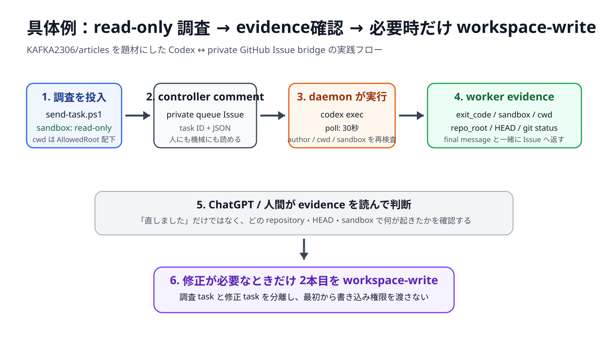
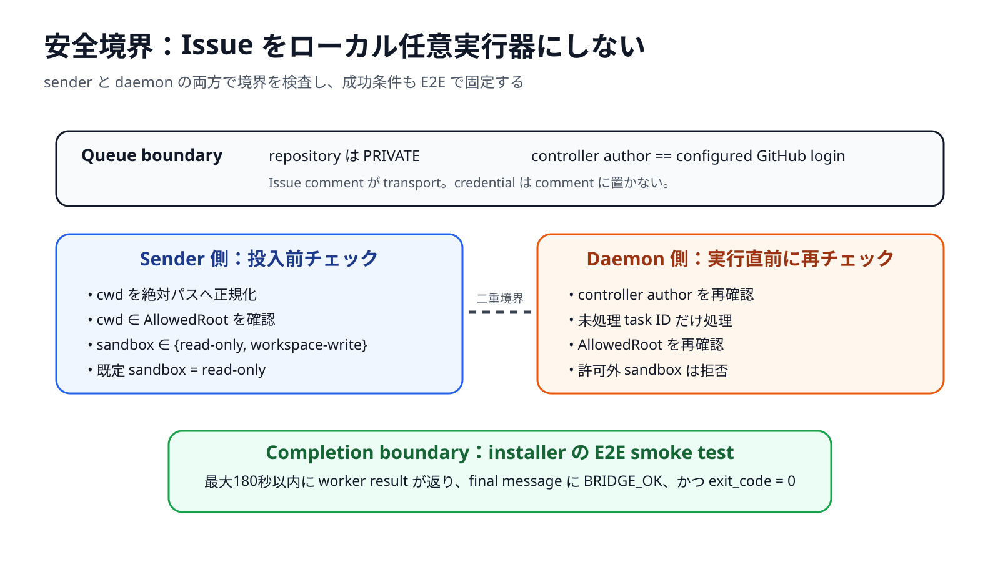

<!-- pipeline_meta: {"idea_source":"public-github-engineering","idea_only":true,"raw_private_content_persisted":false,"topic":{"title":"Codexの結果コピペをやめたくて、private GitHub IssueをAI間のメッセージキューにした","audience":"ChatGPTとローカルCodex CLIを併用するエンジニア","central_question":"ChatGPTとローカルCodex CLIの間で、結果のコピペをせず、安全に実行結果を受け渡せるか","surprising_finding":"難所はCodex実行ではなく、ChatGPT側のGitHub write可否、Codexの追加app/plugin初期化、実行権限境界の3点だった","initial_hypothesis":"private Issueをqueueにすれば単純なpollingだけで成立する","hypothesis_update":"queue自体は単純だが、read-only標準経路・設定隔離・cwd allowlist・smoke testを先に設計しないと自律実行器として危険または不安定になる","stakes":"ローカルagentの結果をChatGPTへ戻す手作業を減らしつつ、credentialや任意ディレクトリ実行を公開しない","story_type":"unexpected-boundary","public_evidence":["https://github.com/KAFKA2306/KAFKA2306/blob/7405e79a2f15d38c455d652e3f91f2b04269b42a/scripts/install-codex-chatgpt-bridge.ps1","https://github.com/KAFKA2306/KAFKA2306/blob/23640ccec32355cad91bb7cfeed34845db54824c/scripts/codex-chatgpt-bridge/bridge-daemon.ps1","https://github.com/KAFKA2306/KAFKA2306/blob/c1ea710695ab71647b9e2d2f9d07caf6ec84bfce/scripts/codex-chatgpt-bridge/README.md","https://developers.openai.com/codex/noninteractive","https://help.openai.com/en/articles/11145903-connecting-github-to-chatgpt","https://cli.github.com/manual/gh_auth_login"]}} -->

# Codexの結果コピペをやめたくて、private GitHub IssueをAI間のメッセージキューにした

ローカルの Codex CLI に調査や修正を任せたあと、最後の出力を ChatGPT に貼り直す。

数回なら気になりません。しかし、調査 → 修正 → テスト → 次の指示、と往復するほど、毎回のコピー＆ペーストがワークフローそのものになります。

そこで、**private GitHub Issue を ChatGPT とローカル Codex の受け渡し場所にする** bridge を作りました。

最初の想定は単純でした。

```text
ChatGPT
  ↓
private GitHub Issue
  ↓
local daemon
  ↓
Codex CLI
  ↓
private GitHub Issue
  ↓
ChatGPT
```

Issue comment を queue にするだけなら、RedisもWebhook serverも公開APIも不要です。

ただし、実装を進めると本当に難しかったのは queue ではありませんでした。

1. ChatGPT から GitHub に「書ける」とは限らない
2. Codex の本体処理と、普段使っている app / plugin / MCP の初期化を分けないといけない
3. ローカル agent にどこまで書き込みを許すかを queue より先に決めないと危険

この3点を分離した結果、公開版は **1コマンド installer + private queue + Windows daemon + read-only既定 + cwd allowlist + end-to-end smoke test** という構成になりました。

公開実装:
https://github.com/KAFKA2306/KAFKA2306/tree/main/scripts/codex-chatgpt-bridge

> **公開昇格条件**
> この原稿は記事候補です。最新公開bundleを実機で再installし、installer末尾の `BRIDGE_OK` と worker payload の `exit_code: 0` を確認するまで、`articles/` へは昇格しません。

## まず具体例：この原稿自身をCodexにレビューさせる

抽象的な構成図だけでは、実際に何が便利なのか分かりにくいので、この原稿自身を題材にします。

前提として、公開repo `KAFKA2306/articles` を Windows の `D:\dev\articles` に clone してあり、bridge の `AllowedRoot` を `D:\dev` に設定したとします。



*図1：公開 sender / daemon の実装仕様に基づく実践フロー。実行ログのスクリーンショットではなく、read-only 調査から必要時のみ workspace-write に昇格する境界を図示しています。*

### 1. まず read-only で「問題だけ」を調べる

ローカル PowerShell から次を実行します。

```powershell
$send = Join-Path $env:LOCALAPPDATA 'OpenAI\CodexChatGPTBridge\send-task.ps1'

powershell.exe -NoProfile -ExecutionPolicy Bypass -File $send `
  -Prompt 'artifacts/candidates/2026-08/2026-08-12-codex-chatgpt-github-issue-bridge.md を読み、初見のエンジニアが手を動かせない箇所を列挙して。特に具体例、実践例、成功判定、失敗時の見方が不足していないか確認する。ファイルは変更しない。' `
  -Cwd 'D:\dev\articles'
```

`-Sandbox` を省略しているため、公開 `send-task.ps1` の既定値である `read-only` が使われます。

実装:
https://github.com/KAFKA2306/KAFKA2306/blob/23640ccec32355cad91bb7cfeed34845db54824c/scripts/codex-chatgpt-bridge/send-task.ps1

sender は task ID を生成し、private Issue に次の形式で controller comment を投稿します。

````md
<!-- codex-bridge:v1 role=controller task=task-20260812-... -->
## Codex task task-20260812-...

```json
{"cwd":"D:\\dev\\articles","sandbox":"read-only","prompt":"..."}
```
````

ここで human-readable な Markdown と machine-readable な JSON を同じ comment に置いているのがポイントです。

### 2. daemon が comment を拾って `codex exec` を実行する

公開daemonの既定poll間隔は30秒です。daemonは comment を古い順に確認し、次を満たす task だけを処理します。

- controller marker がある
- 投稿者が設定済み GitHub login と一致する
- task ID が未処理
- `cwd` が `AllowedRoot` 配下
- sandbox が `read-only` または `workspace-write`

その後、Codex を non-interactive mode で実行します。

```powershell
$promptText | & codex exec `
  --ignore-user-config `
  --disable apps `
  --disable plugins `
  --sandbox $sandbox `
  --json `
  --output-last-message $lastMessage `
  -
```

OpenAI 公式ドキュメントでも、script / CI から Codex を動かす用途には `codex exec` が用意されており、既定sandboxは read-only、編集が必要な場合は `--sandbox workspace-write` を明示する設計です。

公式:
https://developers.openai.com/codex/noninteractive

公開daemon:
https://github.com/KAFKA2306/KAFKA2306/blob/23640ccec32355cad91bb7cfeed34845db54824c/scripts/codex-chatgpt-bridge/bridge-daemon.ps1

### 3. Codexの最終回答だけでなく、実行証拠もIssueへ返す

worker comment は次の構造になります。以下は**形式例**であり、HEAD SHA や task ID は実行時の値です。

````md
<!-- codex-bridge:v1 role=worker task=task-20260812-... -->
## Codex result `task-20260812-...`

```json
{
  "task_id": "task-20260812-...",
  "exit_code": 0,
  "sandbox": "read-only",
  "cwd": "D:\\dev\\articles",
  "git": {
    "repo_root": "D:/dev/articles",
    "head": "<実行時のHEAD SHA>",
    "status": []
  },
  "finished_at": "<UTC timestamp>"
}
```

### Final message

<Codexの最終レビュー>
````

これなら ChatGPT 側は「具体例が足りない」という自然言語だけでなく、**どのrepository・どのHEAD・どのsandboxで、exit codeが何だったか**まで確認できます。

### 4. 指摘が妥当なら、2本目だけ workspace-write にする

たとえば1本目のread-only調査で「具体例がない」と判定されたら、次にローカルsenderから修正taskを投げます。

```powershell
powershell.exe -NoProfile -ExecutionPolicy Bypass -File $send `
  -Prompt '同じ候補記事に、read-only調査 → worker result確認 → workspace-write修正、という一連の具体例を追加して。さらにAllowedRoot違反で停止する失敗例も追加する。既存の公開昇格条件と一次情報URLは残す。' `
  -Cwd 'D:\dev\articles' `
  -Sandbox workspace-write
```

ここで初めてファイル変更を許可します。

つまり、日常運用は次の2段階です。

```text
1回目: read-only
  問題の特定だけ
  ↓
Issueに結果とgit evidence
  ↓
ChatGPT / 人間が判断
  ↓
2回目: workspace-write
  必要な変更だけ
```

「最初から書き込み可能なagentを走らせる」のではなく、**調査と修正を別taskにする**ことで、Issue queue 自体が簡易なレビュー境界になります。

## 失敗例：AllowedRootの外を指定すると、Issueにすら流れない

成功例だけでは安全性が分かりません。

installer を `D:\dev` で実行し、`AllowedRoot = D:\dev` になっている状態で、次のように別領域を指定します。

```powershell
powershell.exe -NoProfile -ExecutionPolicy Bypass -File $send `
  -Prompt 'ここを調べて' `
  -Cwd 'C:\Windows'
```

公開 `send-task.ps1` は GitHub へcommentを投稿する前に path を正規化し、`AllowedRoot` 配下かを検証します。外なら停止します。

```text
Cwd is outside configured allowed_root: D:\dev
```

つまり「private Issue に書ける主体ならPC全体を触れる」という設計にはしていません。

さらにdaemon側でも同じ `AllowedRoot` 検査を行うため、senderを経由せず不正なcontroller commentを直接作った場合にも二重で拒否します。



*図2：公開実装の境界を整理した概念図。sender と daemon の両方で検査し、installer は `BRIDGE_OK` と `exit_code = 0` を E2E 成功条件にします。*

## まず前提を壊した：ChatGPTのGitHub appは標準ではread-only

最初は「ChatGPT が Issue に task を書き、Codex が結果を書き戻す」完全双方向を標準形にするつもりでした。

ところが OpenAI の GitHub app 公式Helpは、通常の GitHub app について repository を読み取り、分析・検索する用途を説明し、**GitHub app単体では code / update / PR をpushできない**と明記しています。

公式:
https://help.openai.com/en/articles/11145903-connecting-github-to-chatgpt

つまり、ChatGPTでGitHubが見えていることと、Issue commentを書けることは同義ではありません。

ここで設計を2つに分けました。

```text
A. Result bridge（標準）
local send-task.ps1
  → private Issue
  → local Codex
  → private Issue
  → ChatGPT reads result

B. Bidirectional bridge（任意）
write-capable GitHub action/plugin
  → private Issue
  → local Codex
  → private Issue
  → ChatGPT
```

標準線を A に置けば、GitHub write action がないChatGPT環境でも、**「Codexの結果をチャットへ貼り直す」作業だけは消せます**。

## なぜGitHub Issueなのか

用途はmessage brokerに近いですが、今回ほしい要件は小さいです。

- controller task が残る
- worker result が残る
- private にできる
- `gh` CLI から読める
- ChatGPT から読み取れる環境がある
- task ID で重複処理を防げる
- 失敗時に人間がブラウザから監査できる

GitHub CLI は公式に browser-based login flow を提供しています。

公式:
https://cli.github.com/manual/gh_auth_login

そのため、bridge独自のGitHub token配布を追加していません。

公開 installer も `gh auth status` を確認し、未認証時だけ公式の `gh auth login --web` へ進みます。

## protocolはMarkdown comment + JSONだけにした

controller側は、Issue comment に機械判定用markerとJSONを置きます。

````md
<!-- codex-bridge:v1 role=controller task=task-20260812-001 -->

```json
{
  "cwd": "D:\\dev\\example",
  "sandbox": "read-only",
  "prompt": "失敗しているテストの原因だけを調べて"
}
```
````

workerは同じ task ID で結果を返します。

```md
<!-- codex-bridge:v1 role=worker task=task-20260812-001 -->
```

結果には final message だけでなく、次も添えます。

- exit code
- sandbox
- absolute cwd
- Git repository root
- HEAD SHA
- bounded `git status --porcelain=v1`

ここで重要なのは、**自然言語だけを返さない**ことです。

「直しました」だけでは、本当に成功したのか、どのrepositoryを触ったのか、未commit差分が残っているのかを次のagentが判断できません。

## 2つ目の失敗：Codex本体ではなく追加機能の初期化で落ちる

non-interactive実行には OpenAI 公式の `codex exec` を使えます。

公式:
https://developers.openai.com/codex/noninteractive

公開daemonでは最終応答をファイルへ取り出し、JSON event stream はローカルだけに残します。

自律daemonに必要なのは、普段の対話型Codex環境を完全再現することではありません。むしろ、普段利用している追加appやpluginの認証・初期化に引きずられると、bridgeのsmoke testまで失敗要因が増えます。

そこで autonomous run だけを user config / app / plugin discovery から分離し、interactive Codex の設定そのものは変更しない構成にしました。

## 3つ目の問題：private queueでも、任意コマンド実行器にしてはいけない

private repository を使えば安全、ではありません。

Issue comment をローカル実行へ直結すると、queueに書ける主体はローカルPC上の agent に指示を出せます。

そのため公開版では、少なくとも次を固定しました。

```text
queue must be PRIVATE
controller author == configured GitHub login
cwd ∈ AllowedRoot
sandbox ∈ {read-only, workspace-write}
default sandbox = read-only
danger-full-access = rejected
```

特に `AllowedRoot` は重要です。

installer を `D:\dev` で実行したなら、bridge task から `C:\Users\...` や別driveへ勝手に移動できないようにします。

また、調査taskは既定 `read-only` にし、修正が必要なときだけ `workspace-write` を明示します。

## 「インストール成功」をdaemon起動にしない

この種の仕組みは、Scheduled Task が登録できただけでは意味がありません。

そこで installer 自身が最後に temporary Git repository を作り、baseline commit を1つ作成したうえで、Issue経由で次のtaskを流します。

```text
This is an end-to-end transport smoke test.
Do not create, modify, or delete any files.
Reply with exactly: BRIDGE_OK
```

成功条件は2つです。

```text
final message contains BRIDGE_OK
exit_code == 0
```

公開 `install.ps1` は最大180秒待ち、条件を満たす worker result が返らなければ installer 自体を失敗させます。

実装:
https://github.com/KAFKA2306/KAFKA2306/blob/23640ccec32355cad91bb7cfeed34845db54824c/scripts/codex-chatgpt-bridge/install.ps1

「daemonを配置できた」と「Issue経由でCodexを実行し、結果を返せた」は別の状態だからです。

## 1コマンドで導入する

Codex に触らせてよい親ディレクトリへ移動してから PowerShell で実行します。既定では、そのカレントディレクトリが `AllowedRoot` になります。

```powershell
$bootstrap = Join-Path $env:TEMP 'install-codex-chatgpt-bridge.ps1'
Invoke-WebRequest -UseBasicParsing `
  -Uri 'https://raw.githubusercontent.com/KAFKA2306/KAFKA2306/7405e79a2f15d38c455d652e3f91f2b04269b42a/scripts/install-codex-chatgpt-bridge.ps1' `
  -OutFile $bootstrap
powershell.exe -NoProfile -ExecutionPolicy Bypass -File $bootstrap
```

installer は次を行います。

1. `gh` / `codex` / `git` / Windows Scheduled Tasks を確認
2. GitHub と Codex の認証状態を確認
3. `<GitHub login>/codex-chatgpt-bridge-queue` を private repository として作成または再利用
4. `Codex ChatGPT Bridge Queue` Issue を作成または再利用
5. daemon / supervisor / task sender を `%LOCALAPPDATA%\OpenAI\CodexChatGPTBridge` に配置
6. logon Scheduled Task を登録
7. bridge を起動
8. baseline commit を持つ temporary Git repository で read-only smoke task を投入
9. worker の `BRIDGE_OK` + `exit_code: 0` を確認

公開ガイド:
https://github.com/KAFKA2306/KAFKA2306/blob/c1ea710695ab71647b9e2d2f9d07caf6ec84bfce/scripts/codex-chatgpt-bridge/README.md

## この設計で「自律」と呼ばないもの

通常のChatGPT GitHub appがread-onlyなら、ChatGPT自身からcontroller taskを書き込む経路は標準機能だけでは成立しません。

そのため公開版では、次を分けて表現します。

- **result transport**: private IssueへCodex結果を返す
- **result observation**: ChatGPTがGitHub appから結果を読む
- **task submission**: local sender、またはwrite actionを持つ環境
- **periodic observation**: 利用可能なscheduled workflowを別途組み合わせる領域

全部を「完全自律」と一語でまとめません。

## まとめ：queueより先に境界を設計する

最初に作ろうとしたのは「Issueを30秒ごとにpollしてCodexを呼ぶ小さなdaemon」でした。

しかし実装の中心になったのはpollingではありませんでした。

```text
transport boundary
  private Issue + task id

identity boundary
  configured GitHub login only

filesystem boundary
  AllowedRoot

execution boundary
  read-only by default

configuration boundary
  ignore user config / disable app + plugin discovery

completion boundary
  BRIDGE_OK + exit_code 0
```

実践上の使い方も単純です。

```text
調査したい
  → read-only task
  → worker evidenceを読む

直したい
  → workspace-write task
  → worker evidenceとgit statusを読む

境界外を触ろうとする
  → sender / daemonで拒否
```

ローカルAI agentを別のAIから扱うとき、便利な接続経路を作ることより、**どの状態なら成功と呼び、どこから先は実行させないか**を先に決める方が重要でした。

private GitHub Issue は、その境界と実行結果を人間にも読める形で残せる、小さなtransportとして使えます。

## 一次情報・実装証拠

- OpenAI Codex non-interactive mode: https://developers.openai.com/codex/noninteractive
- OpenAI Codex CLI reference: https://developers.openai.com/codex/cli/reference
- OpenAI Help — Connecting GitHub to ChatGPT: https://help.openai.com/en/articles/11145903-connecting-github-to-chatgpt
- GitHub CLI — `gh auth login`: https://cli.github.com/manual/gh_auth_login
- 公開bootstrap: https://github.com/KAFKA2306/KAFKA2306/blob/7405e79a2f15d38c455d652e3f91f2b04269b42a/scripts/install-codex-chatgpt-bridge.ps1
- 公開installer: https://github.com/KAFKA2306/KAFKA2306/blob/23640ccec32355cad91bb7cfeed34845db54824c/scripts/codex-chatgpt-bridge/install.ps1
- 公開daemon: https://github.com/KAFKA2306/KAFKA2306/blob/23640ccec32355cad91bb7cfeed34845db54824c/scripts/codex-chatgpt-bridge/bridge-daemon.ps1
- 公開sender: https://github.com/KAFKA2306/KAFKA2306/blob/23640ccec32355cad91bb7cfeed34845db54824c/scripts/codex-chatgpt-bridge/send-task.ps1
- 公開guide: https://github.com/KAFKA2306/KAFKA2306/blob/c1ea710695ab71647b9e2d2f9d07caf6ec84bfce/scripts/codex-chatgpt-bridge/README.md